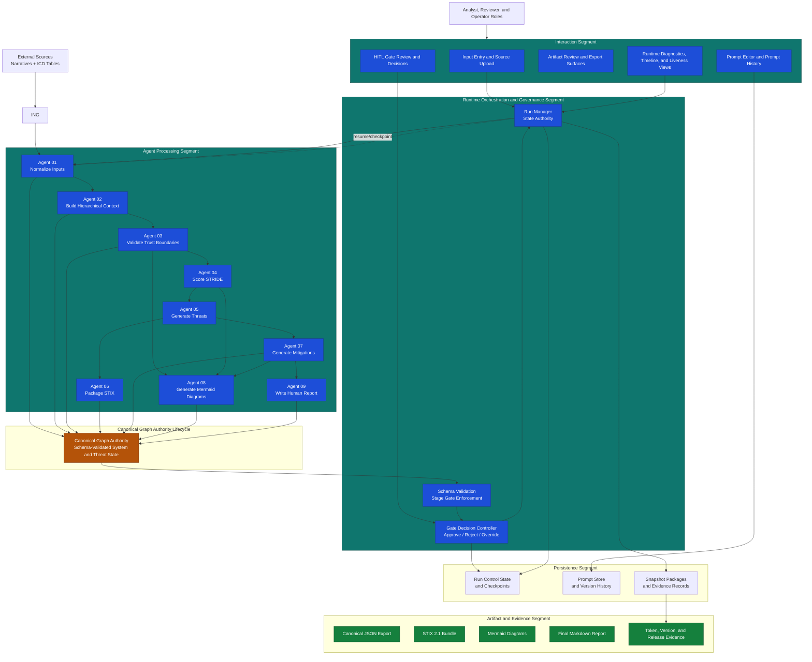
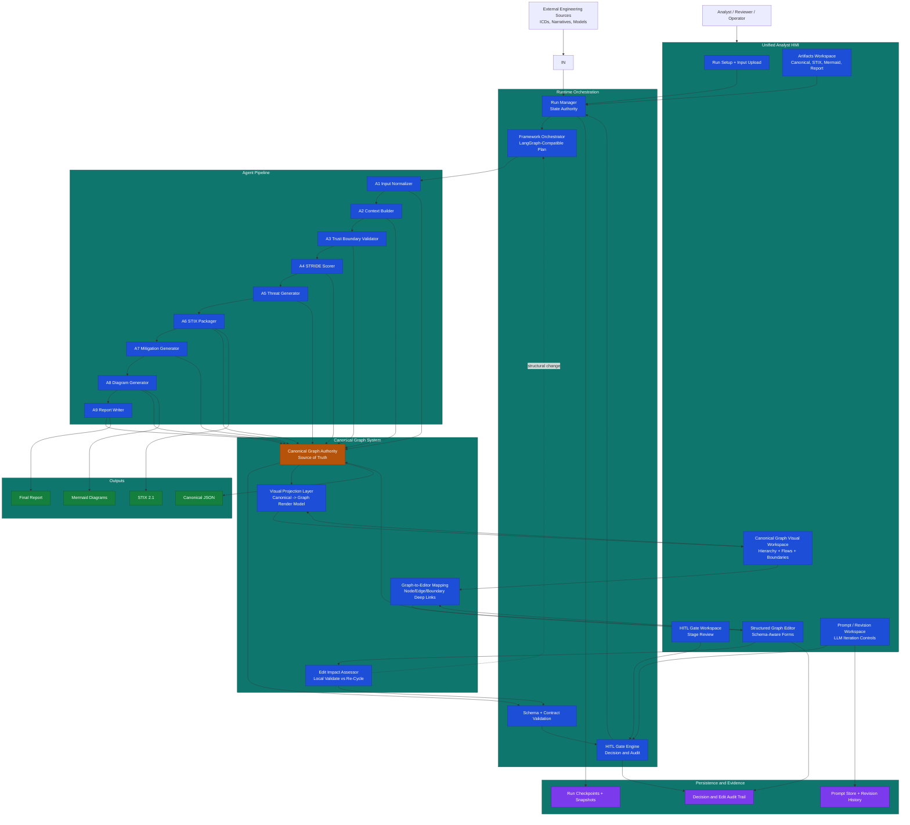

# Multi Agent Threat Modeler

Python-first LangGraph multi-agent threat modeling project for aerospace and ICS-style systems.

## Project Concept

This project defines and implements a multi-agent workflow that converts architecture descriptions and data flows into:

- Canonical threat-model graph
- STRIDE scoring and rationale
- Concrete threats with taxonomy mapping
- Mitigation recommendations
- STIX 2.1 export
- Mermaid diagrams
- Human-readable final report

The architecture is designed for human-in-the-loop governance and auditable, stage-based execution.

## Sprint Naming Governance

Sprint naming was restructured to separate active remediation execution from speculative or parked planning work.

- Canonical automation token: `YYYY_NN` stored in filenames and script arguments as `YYYY_NN`
- Human-readable prose alias: `YYYY-NN`
- The trailing token is a sprint ordinal, not a calendar month
- `2026_99` is reserved as a parking-lot lane for non-remediation or speculative planning work that must not interfere with active sprint automation
- Completed legacy `YYYY-MM` work is preserved as historical record and does not need to be renumbered

See `docs/process/Sprint_Naming_Governance.md` for the migration rationale, current rules, and future `YYYY_NNN` expansion guidance.

## Architecture Baseline and Target State

The current architecture diagram has been validated against implemented runtime and frontend
components, including backend run manager orchestration, sequential agent execution planning,
HITL gate control, canonical graph validation authority, and export/viewer pathways.

Primary target-state additions are a deterministic visual projection layer, graph-to-structured-editor
deep links, and governed edit impact assessment with controlled re-cycle decisions.

Concept reference:

- docs/architecture/Canonical_Graph_Hierarchical_Visualization_Concept.md

Current-state architecture:



Target end-state architecture:



## Technology Baseline

- Primary implementation language: Python
- Orchestration: LangGraph
- Validation: JSON Schema plus Pydantic models
- Testing: Pytest
- Packaging and tooling: Python virtual environment and pip-based dependency management

## Dependency Strategy

Runtime and test dependencies are version-pinned and actively maintained.

- Runtime manifests: requirements.txt, pyproject.toml
- Test/developer manifest: Tests/requirements_e2e.txt
- Governance strategy and boundary rules: Python_Dependency_Strategy.md

## Governance Agent and Skill Structure

The repository now treats governance behavior as a first-class agent/skill system.

Important distinction:

- Repo governance automation is the Independent Reviews, planning, closeout, and portfolio control layer that runs this repository's checks.
- The Multi Agent Threat Modeler is the product runtime that analyzes source artifacts and produces the canonical threat-model outputs.
- Both are multi-agent systems, but they serve different purposes and have different evidence outputs.

- Canonical routing and execution rules live in `docs/process/Governance_Autoflow_Orchestration.md` and `config/governance_autoflow_routing.json`.
- Agent definitions live under `.github/agents/`.
- Skill definitions live under `.github/skills/`.
- Generated governance evidence is written to `independent_reviews/latest/` and historical append-only records are written to `independent_reviews/history/`.
- Independent review GitHub reconciliation is default-on (not opt-in) when `gh` is available, and remains informational by default.

Validation for this structure is expected to cover both direct runner behavior and routed governance behavior.

| Family | Purpose | Example agents / skills | Test command | Evidence artifact |
|---|---|---|---|---|
| Repo governance automation | Validate repository health, route phases, and produce remediation guidance | `independent-review-orchestrator`, `repo-governance-autoflow-orchestrator`, `remediation-readiness`, `multi-sprint-portfolio-planner`, `kpi-drift-analyst` | `python scripts/governance_autoflow.py --context <context> --sprint <SPRINT>` plus direct runner checks such as `python scripts/run_remediation_readiness.py --sprint <SPRINT>` | `independent_reviews/latest/governance_execution_ledger_latest.md`, `independent_reviews/latest/remediation_readiness_latest.md`, `independent_reviews/latest/legacy_findings_latest.md`, `independent_reviews/latest/remediation_issue_drafts_latest.md` |
| Multi Agent Threat Modeler runtime | Analyze input artifacts and produce threat-model outputs | `A1` through `A9` pipeline stages in the runtime architecture | `pytest Tests/` and the relevant runtime/e2e command for the feature under test | `Releases/v1.0.0/`, `exports_for_manual/`, `planning/Test_Execution_Summary_*.md`, `local runtime outputs` |

- Direct checks: run the relevant Python runner scripts for the governance stage being changed.
- Routed checks: run `python scripts/governance_autoflow.py --context <context> --sprint <SPRINT>` for the affected phase.
- Documentation checks: run `npx --yes markdownlint-cli **/*.md` for files touched by the change.
- Syntax checks: run `python -m py_compile` against touched governance scripts.

## Repository Layout

- docs: source architecture, schemas, prompts, and process references
- planning: phased implementation plans and planning artifacts
- Requirements: formal requirements package and component-level requirement sets
- Releases: release notes and release evidence bundles
- Tests: automated and scenario-based tests
- src: Python source code workspace for runtime, agents, and interfaces
- .github/agents: committed agent definitions for governance workflows
- .github/skills: committed skill definitions for governance workflows

## Current Status

Post-Sprint-2026-12 runtime baseline is implemented and release-candidate packaged under Releases/v1.0.0.

Current repository priorities:

- Keep release-candidate documentation and top-level inventories synchronized with implementation.
- Continue hardening and governance follow-up tracked in planning/issues and later sprint packages.
- Preserve historical sprint artifacts as time-bound records rather than rewriting their historical state.

### Completed Deliverables

**Sprint 2026-05 & 2026-06 — Core Runtime and MVP GUI:**

- **Runtime Pipeline** — 9-agent LangGraph orchestrator with canonical graph validation and HITL gates 1–7
  - Orchestrator with validation halt behavior
  - Canonical model (typed dataclasses)
  - JSON Schema + Pydantic validation
  - Input parsing (CSV, XLSX, Markdown, TXT, YAML)
  - Config and model selection
- **HITL Governance** — 7 mandatory and conditional gates with audit trail, selective rerun, and rejection records
- **Artifact Export** — Canonical JSON, STIX 2.1, Mermaid diagrams, Markdown reports
- **Streamlit HMI** — Full screen set delivered (SCR-001 through SCR-014 plus Prompt Editor, Token Usage, Stage Results, Threat Review, Snapshot Manager, Results Export)
- **Evidence & Documentation**
  - 259 automated tests passing (unit + integration)
  - User manual (HTML and Markdown)
  - HMI architecture blueprint (design authority for GUI)

**Sprint 2026-09 — Backend Architecture Decoupling (Completed):**

- **`backend/run_manager.py`** — Pure-Python pipeline execution engine; no Streamlit dependency.
  Owns `_RUN_REGISTRY`, background threads, orchestrator lifecycle, and HITL gate handling.
  Persists run metadata to `~/.multi_agent_threat_modeler_runs.json` for reload recovery.
  Persists a restorable run-state snapshot for completed/paused runs so artifact endpoints remain
  available after backend restart.
  Public API: `submit_run()`, `resume_run()`, `cancel_run()`, `wait_for_run()`, `get_run_status()`.
- **`backend/prompt_store.py`** — Thread-safe, file-backed agent prompt store.
  Persists prompt text, version history, and temperature settings to
  `~/.multi_agent_threat_modeler_prompts.json`.
- **`ui/execution.py`** (refactored) — Now a thin Streamlit adapter; all execution logic
  delegated to `backend/run_manager.py`.
- **`server/api.py`** — operational non-Streamlit HTTP server for run control and LangGraph execution-plan APIs.
  Rehydrates run state from persisted snapshots when in-memory state is unavailable, preventing
  run-list entries from becoming artifact-inaccessible after restart.
- **`__main__.py`** — `python -m threat_modeler` CLI entry point for the operational API server.
- **55 new backend tests** added (total: 259 passing).
- Requirement PRJ-019 (Asynchronous Backend State Authority) fully implemented.

### Sprint 2026-11 Active Closeout Workstreams

- **S11 Governance/Traceability** — execution-mode alignment, traceability delta completion, issue closure evidence.
- **S11 Testing/Release Evidence** — Lane A/Lane B evidence completion, manual validation indexing, closeout summary quality.
- **S11 Documentation Hygiene** — README, manuals, architecture, and sprint documents updated to current runtime behavior and release policy.

## Getting Started

### Quick Start: Runtime Only

```sh
# Create and activate virtual environment
python -m venv .venv
.venv\Scripts\activate      # Windows
# source .venv/bin/activate  # macOS/Linux

# Install runtime dependencies
pip install -r requirements.txt

# Launch the operational API server
python -m threat_modeler

# Or launch on a custom port
python -m threat_modeler --port 9000
```

### Development & Testing

```sh
# Install runtime + test dependencies (includes pytest, playwright, streamlit)
pip install -r Tests/requirements_e2e.txt

# Configure test environment (UTF-8 logs + browser test flags)
.\scripts\set_test_env.ps1

# Run unit tests
python -m pytest Tests/unit/ -q

# Run scripted tests with structured logging under test_reports/YYYY-MM-DD/
python scripts/run_and_log.py scripts/verify_sprint_traceability.py --sprint 2026_11

# Browser E2E smoke (requires GROK_API or GROK_API_KEY)
python scripts/run_and_log.py scripts/live_browser_e2e_smoke.py

# Streamlit HMI (test harness only, not operational)
streamlit run src/threat_modeler/ui/app.py
```

### Git Hooks

Install the repo-managed Git hooks (recommended):

```powershell
.\scripts\install_git_hooks.ps1
```

This configures `core.hooksPath` to `.githooks` for this repository. The included `pre-push` hook runs:

- `python -m pytest Tests/unit/ -q`
- `python scripts/verify_sprint_traceability.py --sprint $TRACEABILITY_SPRINT` (default: `2026_11`)
- `python scripts/archive_hygiene.py check --upstream --enforce`
- `python scripts/validate_cross_domain_exception_policy.py`
- `python scripts/validate_cross_domain_exception_policy.py --proposal-only --propose-missing --proposal-out test_reports/cross_domain_exception_proposals.csv`

The included `pre-commit` and `pre-merge-commit` hooks run:

- `python scripts/archive_hygiene.py check --staged --enforce`

Behavior:

- Unit tests are blocking.
- Traceability verification is warning-only by default to avoid unnecessary push blockers.
- Archive hygiene verification is blocking by default on commit, merge, CI, and pre-push.
- Exception policy verification is blocking by default.
- Set `TRACEABILITY_ENFORCE=1` to make traceability failures blocking.
- Set `ARCHIVE_HYGIENE_ENFORCE=0` to make archive hygiene failures warning-only on pre-push.
- Set `EXCEPTION_POLICY_ENFORCE=0` to make exception policy failures warning-only.

Use this setup to catch local quality and traceability regressions before opening or updating PRs.

### Governance Autoflow (New)

The repository now includes governance autoflow scaffolding that routes local governance checks by execution context:

```bash
python scripts/governance_autoflow.py --context pre-push --sprint 2026_12
```

Supported contexts:

- planning
- pre-commit
- pre-merge-commit
- pre-push
- closeout
- portfolio

Current implementation runs `scripts/independent_repo_review.py` with context-aware profile and enforcement behavior, and establishes the route skeleton for extended governance skills.

Routing is data-configured via:

- `config/governance_autoflow_routing.json`

Every governance autoflow run emits an execution ledger:

- `independent_reviews/latest/governance_execution_ledger_latest.json`
- `independent_reviews/latest/governance_execution_ledger_latest.md`
- `independent_reviews/history/governance_execution_ledger.jsonl`

Operator commands:

- `./scripts/run_governance_planning.ps1 -Sprint 2026_12`
- `./scripts/run_governance_closeout.ps1 -Sprint 2026_12`
- `./scripts/run_governance_planning.sh 2026_12`
- `./scripts/run_governance_closeout.sh 2026_12`

See [docs/process/Governance_Autoflow_Orchestration.md](docs/process/Governance_Autoflow_Orchestration.md) for routing matrix, agent list, and rollout status.

### Governance Agent and Skill Catalog

In addition to independent review and traceability specialists, the repository now scaffolds governance agents and skills for:

- requirements baseline quality
- architecture contract enforcement
- verification coverage planning
- artifact lineage auditing
- sprint intake gating
- sprint execution compliance
- sprint closeout certification
- multi-sprint portfolio planning
- policy compilation
- KPI drift analysis

These assets are located under `.github/agents/` and `.github/skills/` and are intended to be used through orchestration rather than ad hoc invocation.

### Dependency Strategy Summary

**Runtime Dependencies** (`requirements.txt`):

- `openai` — LLM integration
- `langgraph` — Agent orchestration
- `chromadb` — Vector store for retrieval
- `stix2` — STIX 2.1 export format
- `python-dotenv` — Environment variable loading

**Test Dependencies** (`Tests/requirements_e2e.txt`):

- Includes all runtime dependencies (via `-r ../requirements.txt`)
- `pytest`, `pytest-cov` — Unit and integration testing
- `playwright`, `pytest-playwright` — Browser automation for E2E
- `streamlit` — Development HMI test harness only
- Additional test utilities (json-report, timeout, etc.)

This separation keeps the production release minimal while providing comprehensive testing infrastructure for development.

## Test Execution

All test commands and infrastructure are documented in [Tests/README.md](Tests/README.md).

### Quick Reference

```bash
# Environment setup (one-time, recommended before test runs)
.\scripts\set_test_env.ps1

# Unit tests (fast, local)
python -m pytest Tests/unit/ -q

# Sprint traceability verification (logs to test_reports/)
python scripts/run_and_log.py scripts/verify_sprint_traceability.py --sprint 2026_11

# Archive hygiene check for staged, upstream, or explicit paths
python scripts/archive_hygiene.py check --paths planning/archives/2026-05/README.md

# Archive batch note scaffold
python scripts/archive_hygiene.py scaffold --archive-root planning/archives --batch 2026-05 --note-name archive_sweep_note.md --title "Planning Archive Sweep"

# Cross-domain exception policy strict gate
python scripts/validate_cross_domain_exception_policy.py

# Proposal-only remediation output for missing exception rows
python scripts/validate_cross_domain_exception_policy.py --proposal-only --propose-missing --proposal-out test_reports/cross_domain_exception_proposals.csv

# Dependency boundary hardening (release/runtime must exclude test-only deps)
python scripts/verify_dependency_boundary.py

# E2E browser tests (requires GROK_API environment variable)
python scripts/run_and_log.py scripts/live_browser_e2e_smoke.py
```

### Sprint 2026-12 Live Test Policy

- Live test execution is standardized to Grok-only in this repository for Sprint 2026-12.
- Required credential for live lanes: `GROK_API` (or `GROK_API_KEY` where supported by script wrappers).
- OpenAI-live execution is excluded by default and is not required for sprint validation in this environment.
- Default CI-safe lane remains:

```bash
python -m pytest Tests/ -q -m "not llm_live and not llm_live_browser"
```

- Approved live validation lane (Grok only):

```bash
python -m pytest Tests/e2e/test_live_llm_validation.py -v -m llm_live -s
```

### Test Organization

- **Unit tests** → `Tests/unit/` — Fast validation of core functions
- **Integration tests** → `Tests/integration/` — Multi-module orchestration tests
- **E2E tests** → `Tests/e2e/` — Full pipeline from input to artifact export
- **Test fixtures** → `Tests/fixtures/` — Sample inputs and expected outputs
- **Test reports** → `Tests/test_reports/YYYY-MM-DD/[test_type]/` — Logs organized by date and type

### Test Infrastructure

- **`scripts/run_and_log.py`** — Universal test runner with UTF-8 logging and environment validation
- **`scripts/set_test_env.ps1`** — Environment setup (PYTHONIOENCODING, browser flags, GROK_API check)
- **`Tests/requirements_e2e.txt`** — Consolidated test dependencies
- **`Tests/conftest.py`** — Pytest configuration and fixtures
- **`Tests/pytest.ini`** — Pytest test discovery and behavior settings
