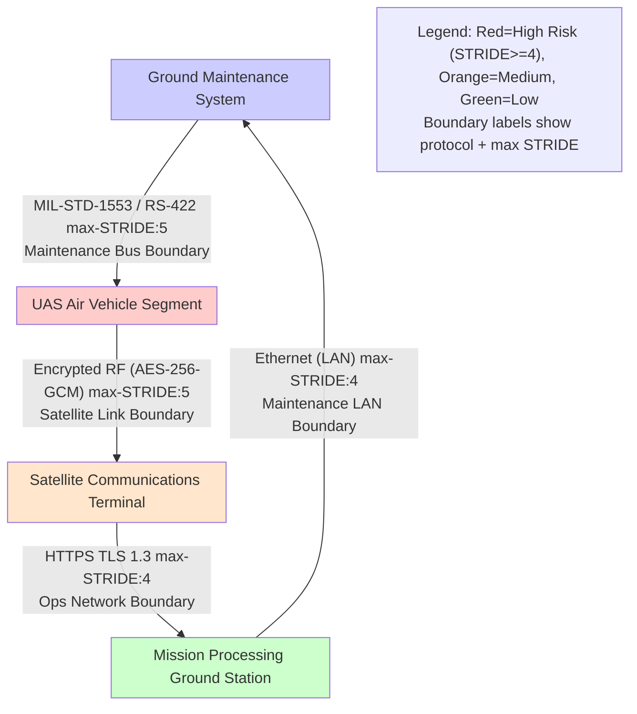
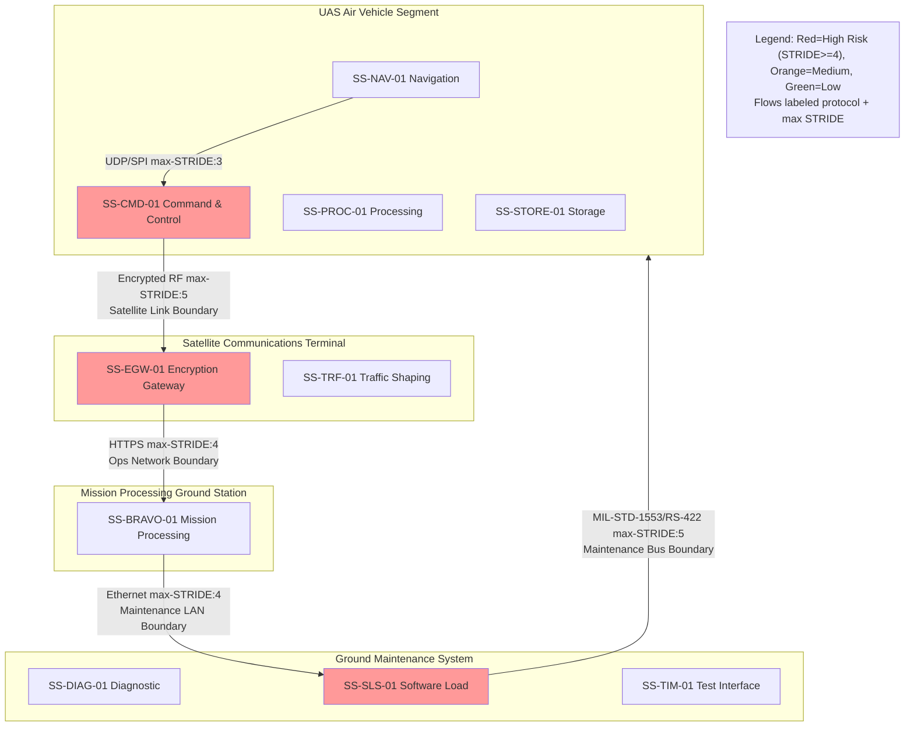
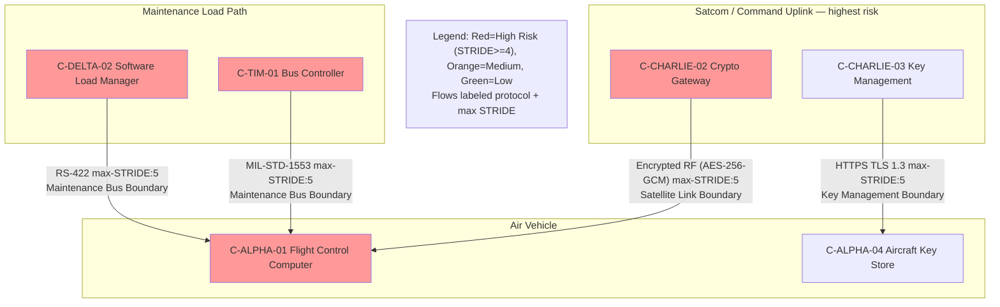

# Mermaid Diagrams

## level_0

```mermaid
flowchart TD
  subgraph AV["UAS Air Vehicle Segment"]
  end
  subgraph SAT["Satellite Communications Terminal"]
  end
  subgraph GS["Mission Processing Ground Station"]
  end
  subgraph MAINT["Ground Maintenance System"]
  end
  AV -->|"Encrypted RF (AES-256-GCM) max-STRIDE:5<br>Satellite Link Boundary"| SAT
  SAT -->|"HTTPS TLS 1.3 max-STRIDE:4<br>Ops Network Boundary"| GS
  MAINT -->|"MIL-STD-1553 / RS-422 max-STRIDE:5<br>Maintenance Bus Boundary"| AV
  GS -->|"Ethernet (LAN) max-STRIDE:4<br>Maintenance LAN Boundary"| MAINT
  style AV fill:#ffcccc
  style SAT fill:#ffe6cc
  style GS fill:#ccffcc
  style MAINT fill:#ccccff
  legend["Legend: Red=High Risk (STRIDE>=4), Orange=Medium, Green=Low<br>Boundary labels show protocol + max STRIDE"]
```

## level_1

```mermaid
flowchart TD
  subgraph AV["UAS Air Vehicle Segment"]
    NAV["SS-NAV-01 Navigation"]
    CMD["SS-CMD-01 Command & Control"]
    PROC["SS-PROC-01 Processing"]
    STORE["SS-STORE-01 Storage"]
  end
  subgraph SAT["Satellite Communications Terminal"]
    EGW["SS-EGW-01 Encryption Gateway"]
    TRF["SS-TRF-01 Traffic Shaping"]
  end
  subgraph GS["Mission Processing Ground Station"]
    MP["SS-BRAVO-01 Mission Processing"]
  end
  subgraph MAINT["Ground Maintenance System"]
    DIAG["SS-DIAG-01 Diagnostic"]
    SLS["SS-SLS-01 Software Load"]
    TIM["SS-TIM-01 Test Interface"]
  end
  NAV -->|"UDP/SPI max-STRIDE:3"| CMD
  CMD -->|"Encrypted RF max-STRIDE:5<br>Satellite Link Boundary"| EGW
  EGW -->|"HTTPS max-STRIDE:4<br>Ops Network Boundary"| MP
  MP -->|"Ethernet max-STRIDE:4<br>Maintenance LAN Boundary"| SLS
  SLS -->|"MIL-STD-1553/RS-422 max-STRIDE:5<br>Maintenance Bus Boundary"| AV
  style CMD fill:#ff9999
  style EGW fill:#ff9999
  style SLS fill:#ff9999
  legend["Legend: Red=High Risk (STRIDE>=4), Orange=Medium, Green=Low<br>Flows labeled protocol + max STRIDE"]
```

## level_2

```mermaid
flowchart TD
  subgraph SAT["Satcom / Command Uplink — highest risk"]
    C1["C-CHARLIE-02 Crypto Gateway"]
    C2["C-CHARLIE-03 Key Management"]
  end
  subgraph AV["Air Vehicle"]
    C3["C-ALPHA-01 Flight Control Computer"]
    C4["C-ALPHA-04 Aircraft Key Store"]
  end
  subgraph MAINT["Maintenance Load Path"]
    C5["C-DELTA-02 Software Load Manager"]
    C6["C-TIM-01 Bus Controller"]
  end
  C1 -->|"Encrypted RF (AES-256-GCM) max-STRIDE:5<br>Satellite Link Boundary"| C3
  C2 -->|"HTTPS TLS 1.3 max-STRIDE:5<br>Key Management Boundary"| C4
  C5 -->|"RS-422 max-STRIDE:5<br>Maintenance Bus Boundary"| C3
  C6 -->|"MIL-STD-1553 max-STRIDE:5<br>Maintenance Bus Boundary"| C3
  style C1 fill:#ff9999
  style C3 fill:#ff9999
  style C5 fill:#ff9999
  style C6 fill:#ff9999
  legend["Legend: Red=High Risk (STRIDE>=4), Orange=Medium, Green=Low<br>Flows labeled protocol + max STRIDE"]
```
