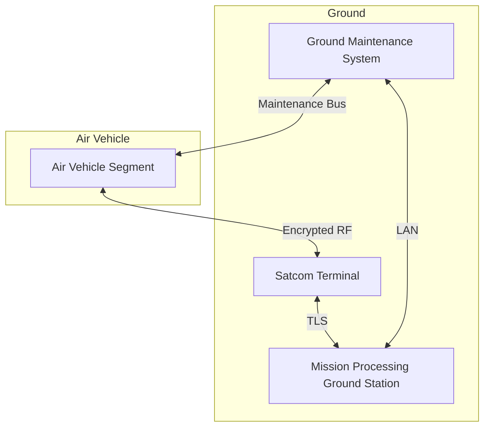
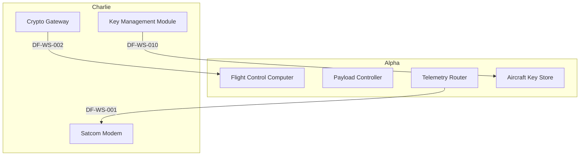
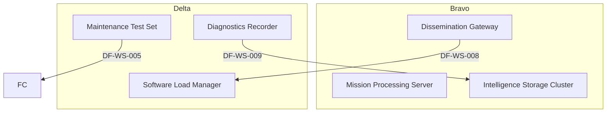

# Threat Model Report — UAS Weapon System FQT

## Executive Summary

The UAS Weapon System FQT is a high mission- and safety-critical multi-segment ISR platform whose primary risk posture is driven by the satellite link, maintenance bus, and key-management boundaries. The highest-impact threats are satellite-link jamming, command injection via spoofed uplinks, malicious software loads, and key-material tampering; these can result in loss of vehicle control or compromise of all encrypted traffic. Mitigations center on cryptographic signing, anti-jam antennas, mutual authentication with nonces, HSM-wrapped key ceremonies, and dual-approval workflows, which reduce residual risk to moderate levels for all critical data flows.

## System Scope and Description

UAS Weapon System FQT is a multi-segment intelligence, surveillance, and reconnaissance (ISR) system consisting of the UAS Air Vehicle Segment (SS-ALPHA-01), Mission Processing Ground Station (SS-BRAVO-01), Satellite Communications Terminal (SS-CHARLIE-01), Ground Maintenance System (SS-DELTA-01), and supporting navigation, command, processing, storage, encryption, and diagnostic subsystems. The system is rated HIGH for both mission and safety criticality and executes autonomous flight, sensor collection, payload fusion, encrypted satcom relay, and post-flight maintenance operations.

## Trust Boundaries

- **Satellite Link Boundary**: DF-WS-001 (Telemetry and Sensor Data Downlink), DF-WS-002 (Command and Control Uplink), DF-WS-010 (Key Provisioning)
- **Ops Network Boundary**: DF-WS-003 (Processed Mission Data Forward), DF-WS-004 (Mission Tasking and Retasking)
- **Maintenance Bus Boundary**: DF-WS-005 (Maintenance Diagnostic Query), DF-WS-006 (Post-Flight HUMS Download), DF-WS-007 (Software Load Transfer), DF-D-002, DF-D-003, DF-D-004, DF-D-008, DF-D-009
- **Maintenance LAN Boundary**: DF-WS-008 (Software Package Distribution), DF-WS-009 (Maintenance Log Sync), DF-D-006, DF-D-007, DF-D-010
- **Key Management Boundary**: DF-WS-010 (Key Provisioning)
- **External Radio Link**: DF-003 (Operator Command Uplink)
- **Operations Network Boundary**: DF-103 (Remote Diagnostics Pull)

## Data Flow Diagrams

## STRIDE Findings

| Data Flow | S | T | R | I | D | E | Key Justification |
|-----------|---|---|---|---|---|---|-------------------|
| DF-WS-001 | 4 | 4 | 3 | 4 | 5 | 3 | High availability and confidentiality impact on ISR downlink |
| DF-WS-002 | 4 | 5 | 3 | 3 | 5 | 4 | Direct safety impact from tampered flight commands |
| DF-WS-007 | 4 | 5 | 3 | 2 | 3 | 4 | Code-execution privilege on payload controller |
| DF-WS-010 | 4 | 5 | 3 | 4 | 4 | 4 | Total loss of encryption if keys are compromised |
| DF-003 | 4 | 4 | 3 | 2 | 4 | 3 | External radio link allows command spoofing |

## Top Threats

1. Satellite Link Jamming (likelihood 4, impact 5) – MITRE T1498
1. Command Injection via Spoofed Uplink (likelihood 4, impact 5) – MITRE T0866
1. Malicious Software Load via RS-422 (likelihood 4, impact 5) – MITRE T0895
1. Key Material Tampering (likelihood 4, impact 5) – MITRE T1552
1. Rogue 1553 Software Load (likelihood 4, impact 5) – MITRE T0895

## Mitigation Mapping and Residual Risk

| Threat | Technical Controls | Administrative Controls | Residual Risk |
|--------|--------------------|-------------------------|---------------|
| Satellite Link Jamming | CTRL-001 Anti-Jam Antenna and Spread Spectrum | CTRL-002 Jamming Detection and Fallback Procedure | 2–3 |
| Command Injection via Spoofed Uplink | CTRL-003 Mutual Authentication with Nonces | CTRL-004 Command Authorization SOP | 2–3 |
| Malicious Software Load via RS-422 | CTRL-013 RS-422 Secure Loader with Signature Check | CTRL-014 Software Load Authorization | 2 |
| Key Material Tampering | CTRL-017 Hardware Security Module Key Wrapping | CTRL-018 Key Ceremony and Rotation Schedule | 2 |
| Rogue 1553 Software Load | CTRL-033 1553 Load with Dual Signature Check | CTRL-034 Load Authorization and Witnessing | 2 |

## Appendix

- Generation timestamp: 2025-01-01T00:00:00Z
- Model level: system
- All referenced data-flow IDs (DF-WS-001 through DF-D-010) and control IDs exist in the approved artifact set.
- No missing artifacts; report released for analyst review.
