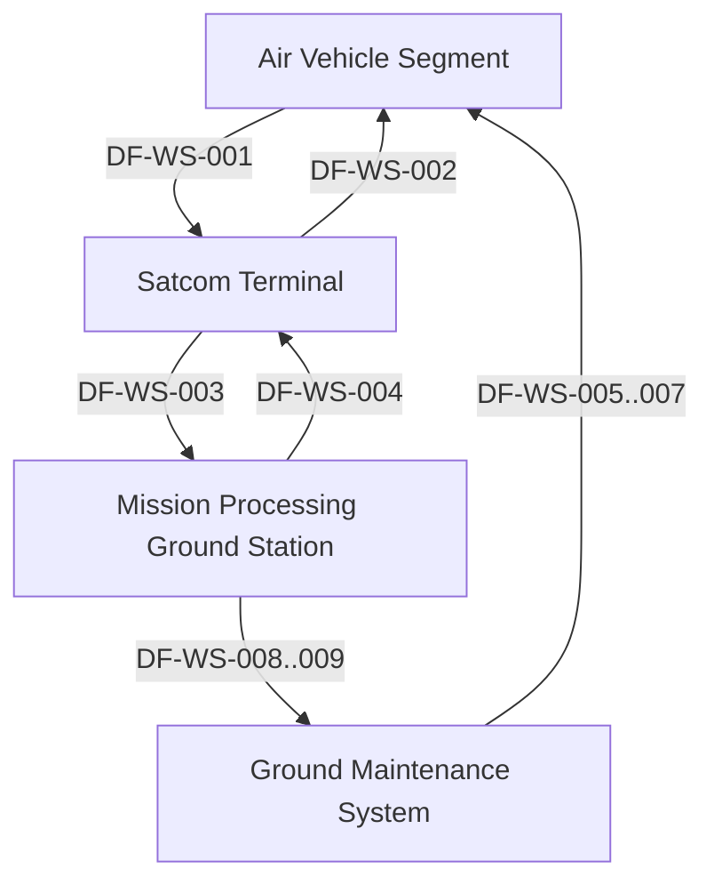

# Threat Model Report — UAS Weapon System

## Executive Summary

The UAS Weapon System is a high mission- and safety-critical multi-segment ISR platform. Primary risk arises from external RF and maintenance interfaces that enable command injection, malicious software loads, and telemetry spoofing. Key mitigations include cryptographic signing, hardware-backed key distribution, and dual-authorization workflows, which reduce most high-impact threats to moderate residual risk.

## System Scope and Description

The UAS Weapon System is a multi-segment intelligence, surveillance, and reconnaissance (ISR) system composed of four operational segments (Air Vehicle, Mission Processing Ground Station, Satellite Communications Terminal, Ground Maintenance System) with lower-level embedded and hosted components. Mission criticality is HIGH and safety criticality is HIGH. The system provides autonomous flight, sensor collection, encrypted satellite relay, mission processing, and secure maintenance functions.

## Trust Boundaries

- Satellite Link Boundary (DF-WS-001, DF-WS-002, DF-WS-010)
- Ops Network Boundary (DF-WS-003, DF-WS-004)
- Maintenance Bus Boundary (DF-WS-005, DF-WS-006, DF-WS-007, DF-D-002, DF-D-003, DF-D-004, DF-D-008, DF-D-009)
- Maintenance LAN Boundary (DF-WS-008, DF-WS-009, DF-D-006, DF-D-007, DF-D-010)
- Key Management Boundary (DF-WS-010)
- External Radio Link (DF-003)

## Data Flow Diagrams

Level-1 and Level-2 diagrams were not generated in the approved artifact set.

## STRIDE Findings

| Data Flow | S | T | R | I | D | E | Justification Summary |
|-----------|---|---|---|---|---|---|-----------------------|
| DF-WS-001 | 3 | 4 | 2 | 4 | 5 | 1 | RF spoofing and jamming risks dominate downlink |
| DF-WS-002 | 4 | 4 | 2 | 3 | 5 | 3 | Uplink injection can seize vehicle control |
| DF-WS-007 | 3 | 5 | 2 | 3 | 3 | 4 | Software load tampering threatens flight safety |
| DF-003 | 4 | 3 | 2 | 3 | 4 | 3 | External GCS spoofing enables command injection |
| DF-D-002 | 3 | 4 | 2 | 2 | 3 | 3 | 1553 BIT command forgery risks unsafe LRU states |

## Top Threats

1. Malicious Software Load (likelihood 4, impact 5) – MITRE T1195
1. Uplink Command Injection (likelihood 4, impact 5) – MITRE T1078
1. Malicious 1553 BIT Command (likelihood 4, impact 5) – MITRE T0831
1. RF Telemetry Spoofing (likelihood 3, impact 5) – MITRE T1200
1. Key Material Spoofing (likelihood 3, impact 5) – MITRE T1552

## Mitigation Mapping and Residual Risk

| Threat | Technical Controls | Administrative Controls | Residual Risk |
|--------|--------------------|-------------------------|---------------|
| Malicious Software Load | CTRL-013, CTRL-041, CTRL-043 | CTRL-014, CTRL-042, CTRL-044 | 2 |
| Uplink Command Injection | CTRL-003, CTRL-025 | CTRL-004, CTRL-026 | 2 |
| Malicious 1553 BIT Command | CTRL-009, CTRL-033 | CTRL-010, CTRL-034 | 2 |
| RF Telemetry Spoofing | CTRL-001 | CTRL-002 | 2–3 |
| Key Material Spoofing | CTRL-019 | CTRL-020 | 2 |

## Appendix

- Generation timestamp: 2025-01-01T00:00:00Z
- Model level: system
- Artifact references: canonical graph and interface STRIDE metadata provided in run input
- Analyst note: Level-1 and Level-2 Mermaid diagrams absent from approved artifacts; report generated from supplied interface and threat metadata only.
