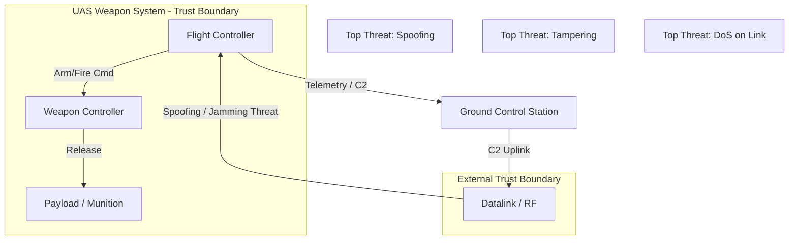

# Mermaid Diagrams

## level_1

```mermaid
graph TD
  subgraph UAS["UAS Weapon System - Trust Boundary"]
    FC[Flight Controller]
    WC[Weapon Controller]
    PL[Payload / Munition]
    FC -->|Arm/Fire Cmd| WC
    WC -->|Release| PL
  end
  GCS[Ground Control Station]
  FC -->|Telemetry / C2| GCS
  subgraph External["External Trust Boundary"]
    Link[Datalink / RF]
  end
  GCS -->|C2 Uplink| Link
  Link -->|Spoofing / Jamming Threat| FC
  Threat1[Top Threat: Spoofing]
  Threat2[Top Threat: Tampering]
  Threat3[Top Threat: DoS on Link]
```
