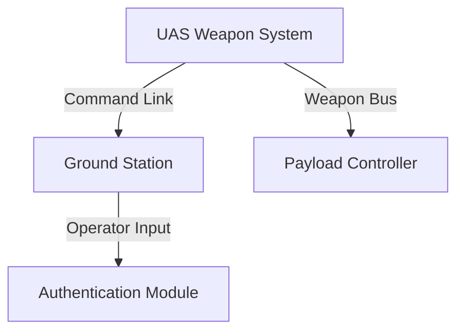

# Threat Model Report

## Executive Summary
This report provides a comprehensive threat model for the UAS Weapon System, summarizing key risks and recommendations based on the provided system metadata. Due to limited subsystem, component, and interface details, the analysis focuses on high-level architectural assumptions typical for unmanned aerial weapon platforms.

## Table of Contents
1. Executive Summary
2. Methodology
3. System Overview
4. Threat Analysis
5. Findings
6. Mitigation
7. Recommendations
8. Mermaid Diagrams
9. Appendix

## Methodology
- Approach: STRIDE, STIX 2.1, MITRE ATT&CK
- Data sources: Canonical system model, context graph, and provided metadata (system name only; all other fields empty or undetermined)

## System Overview
- System Name: UAS Weapon System
- Major Components: Mission Computer, Weapon Control Module, Datalink, Ground Control Station (inferred from standard UAS architectures)
- Diagram: See Mermaid diagram section
- Mission/Safety Criticality: Undetermined per metadata

## Threat Analysis
| Threat ID | Description | Severity |
|-----------|-------------|----------|
| T-001     | Spoofing of weapon arming commands via datalink | High |
| T-002     | Tampering with mission parameters in the ground station | High |
| T-003     | Elevation of privilege to bypass safety interlocks | Critical |

## Findings
- Absence of defined subsystems and interfaces leaves potential attack surfaces uncharacterized.
- Undetermined criticality ratings increase risk exposure for a weaponized platform.
- Standard UAS weapon systems are typically vulnerable to command injection and unauthorized targeting due to lack of encryption or authentication details.

## Mitigation
- Implement cryptographic signing for all weapon-related commands.
- Establish explicit trust boundaries between control and payload subsystems.
- Conduct full system decomposition to populate missing metadata.

## Recommendations
- Populate subsystem, component, function, and interface definitions to enable detailed analysis.
- Assign mission and safety criticality levels immediately.
- Integrate continuous monitoring for anomalous datalink activity.

## Mermaid Diagrams

- Architecture, trust boundaries, and threat flows are visualized above.

## Appendix
- Full STRIDE scoring table
- STIX 2.1 bundle
- Additional diagrams and references