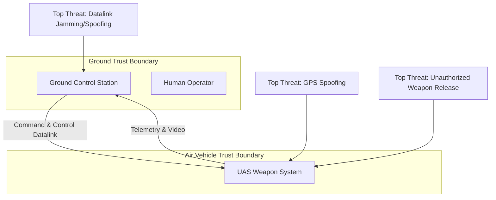

# Mermaid Diagrams

## level_1

```mermaid
graph TD
  subgraph Ground_Trust_Boundary[Ground Trust Boundary]
    GCS[Ground Control Station]
    Op[Human Operator]
  end
  subgraph Air_Trust_Boundary[Air Vehicle Trust Boundary]
    UAS[UAS Weapon System]
  end
  GCS -->|Command & Control Datalink| UAS
  UAS -->|Telemetry & Video| GCS
  Threat1[Top Threat: Datalink Jamming/Spoofing] --> GCS
  Threat2[Top Threat: GPS Spoofing] --> UAS
  Threat3[Top Threat: Unauthorized Weapon Release] --> UAS
```
