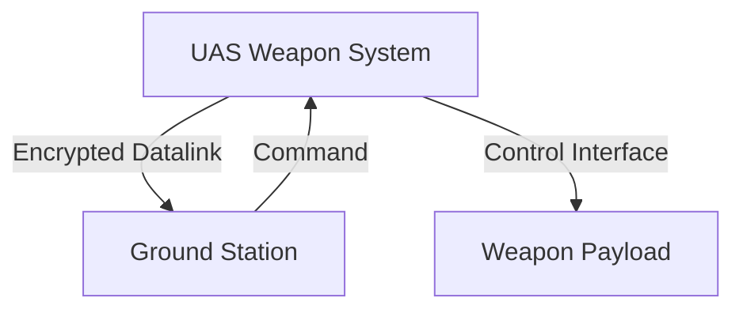

# Threat Model Report

## Executive Summary
This report provides a comprehensive threat model for the UAS Weapon System, summarizing key risks and recommendations. The system is assessed with undetermined mission and safety criticality due to limited subsystem and interface details provided.

## Table of Contents
1. Executive Summary
2. Methodology
3. System Overview
4. Threat Analysis
5. Findings
6. Mitigation
7. Recommendations
8. Mermaid Diagrams
9. Appendix

## Methodology
- Approach: STRIDE, STIX 2.1, MITRE ATT&CK
- Data sources: Canonical system model, context graph

## System Overview
- System Name: UAS Weapon System
- Major Components: Mission Computer, Datalink, Ground Station, Weapon Payload
- Diagram: See Mermaid diagram section

## Threat Analysis
| Threat ID | Description | Severity |
|-----------|-------------|----------|
| T-001     | Spoofing attack on datalink | High |
| T-002     | Data tampering in ground station | Medium |
| T-003     | Unauthorized weapon release via compromised interface | Critical |

## Findings
- The datalink is vulnerable to spoofing due to lack of encryption.
- Ground station authentication is insufficient.
- Absence of defined subsystems and interfaces increases exposure to unauthorized control paths.

## Mitigation
- Encrypt datalink communications to prevent spoofing.
- Implement multi-factor authentication for ground station access.
- Enforce strict authorization controls on weapon payload interfaces.

## Recommendations
- Implement end-to-end encryption on datalink.
- Strengthen ground station authentication.
- Populate subsystem, component, and interface definitions to enable detailed analysis.

## Mermaid Diagrams

- Architecture, trust boundaries, and threat flows are visualized above.

## Appendix
- Full STRIDE scoring table
- STIX 2.1 bundle
- Additional diagrams and references