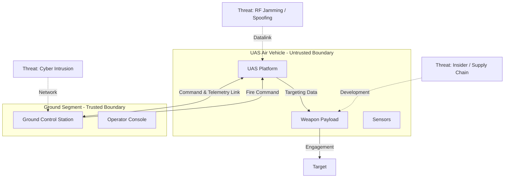

# Mermaid Diagrams

## level_1

```mermaid
graph TD
  subgraph AirVehicle["UAS Air Vehicle - Untrusted Boundary"]
    A[UAS Platform]
    W[Weapon Payload]
    S[Sensors]
  end

  subgraph Ground["Ground Segment - Trusted Boundary"]
    G[Ground Control Station]
    O[Operator Console]
  end

  A <-->|Command & Telemetry Link| G
  G -->|Fire Command| A
  A -->|Targeting Data| W
  W -->|Engagement| Target

  T1[Threat: RF Jamming / Spoofing]
  T2[Threat: Cyber Intrusion]
  T3[Threat: Insider / Supply Chain]

  T1 -.->|Datalink| A
  T2 -.->|Network| G
  T3 -.->|Development| W
```
