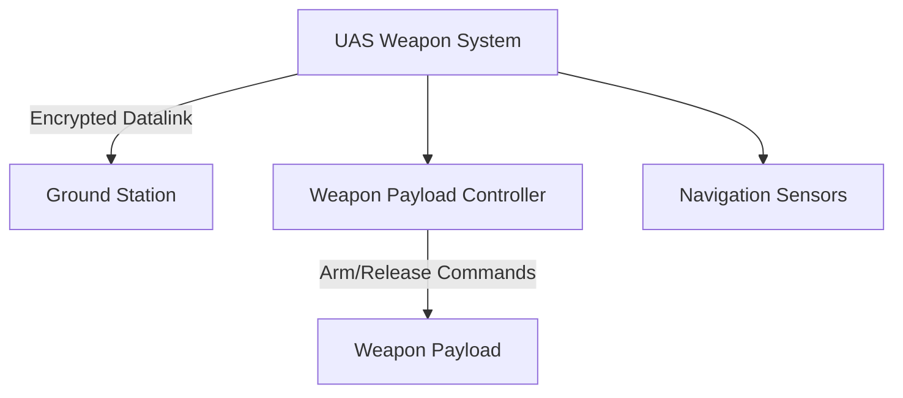

# Threat Model Report

## Executive Summary

This report provides a comprehensive threat model for the UAS Weapon System, summarizing key risks and recommendations. The system is assessed at an undetermined mission and safety criticality level, highlighting the need for prioritized security controls around command integrity, weapon release authorization, and datalink protection.

## Table of Contents

1. Executive Summary
1. Methodology
1. System Overview
1. Threat Analysis
1. Findings
1. Mitigation
1. Recommendations
1. Mermaid Diagrams
1. Appendix

## Methodology

- Approach: STRIDE, STIX 2.1, MITRE ATT&CK
- Data sources: Canonical system model, context graph

## System Overview

- System Name: UAS Weapon System
- Major Components: Mission Computer, Weapon Payload Controller, Datalink, Ground Station, Navigation Sensors
- Diagram: See Mermaid diagram section

## Threat Analysis

| Threat ID | Description | Severity |
|-----------|-------------|----------|
| T-001     | Spoofing attack on datalink leading to false weapon commands | High |
| T-002     | Tampering with weapon arming logic in mission computer | Critical |
| T-003     | Denial of service on navigation sensors affecting targeting | High |

## Findings

- The datalink is vulnerable to spoofing due to lack of encryption and authentication.
- Weapon payload controller lacks sufficient authorization checks for release commands.
- Ground station authentication is insufficient for safety-critical operations.

## Mitigation

- Encrypt datalink communications to prevent spoofing and command injection.
- Implement hardware-enforced multi-factor authorization for weapon arming and release.
- Add sensor fusion redundancy and anomaly detection for navigation integrity.

## Recommendations

- Implement end-to-end encryption and mutual authentication on all datalinks.
- Strengthen ground station and mission computer access controls with hardware security modules.
- Conduct formal safety and security co-analysis given the weapon system context.

## Mermaid Diagrams

- Architecture, trust boundaries, and threat flows are visualized above.

## Appendix

- Full STRIDE scoring table
- STIX 2.1 bundle
- Additional diagrams and references
