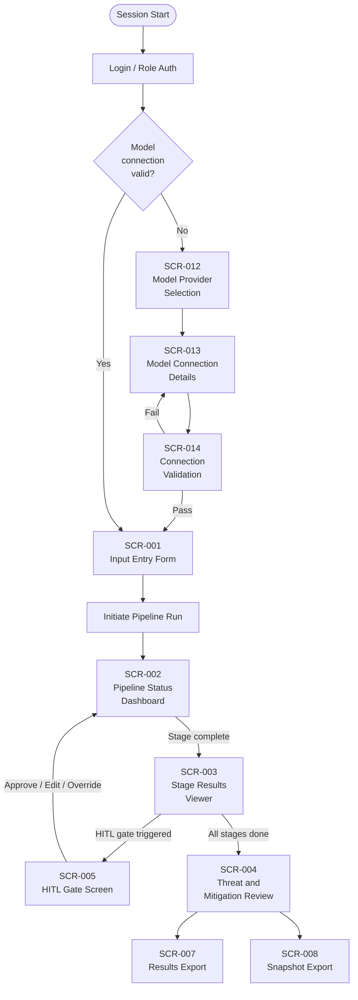
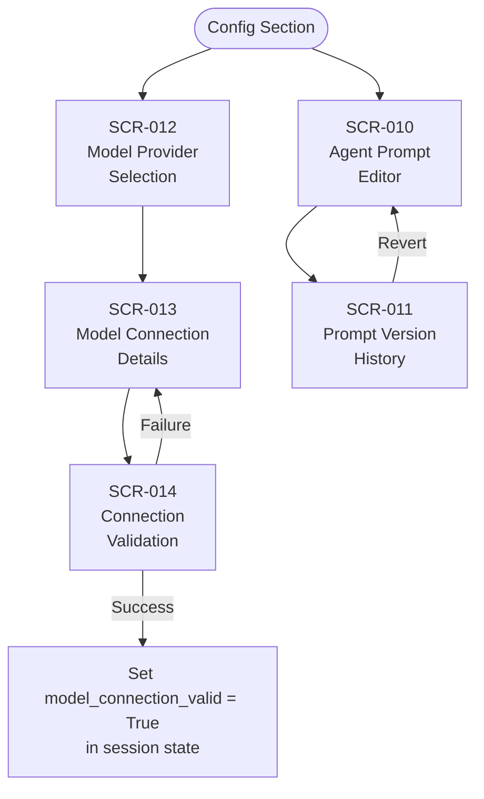
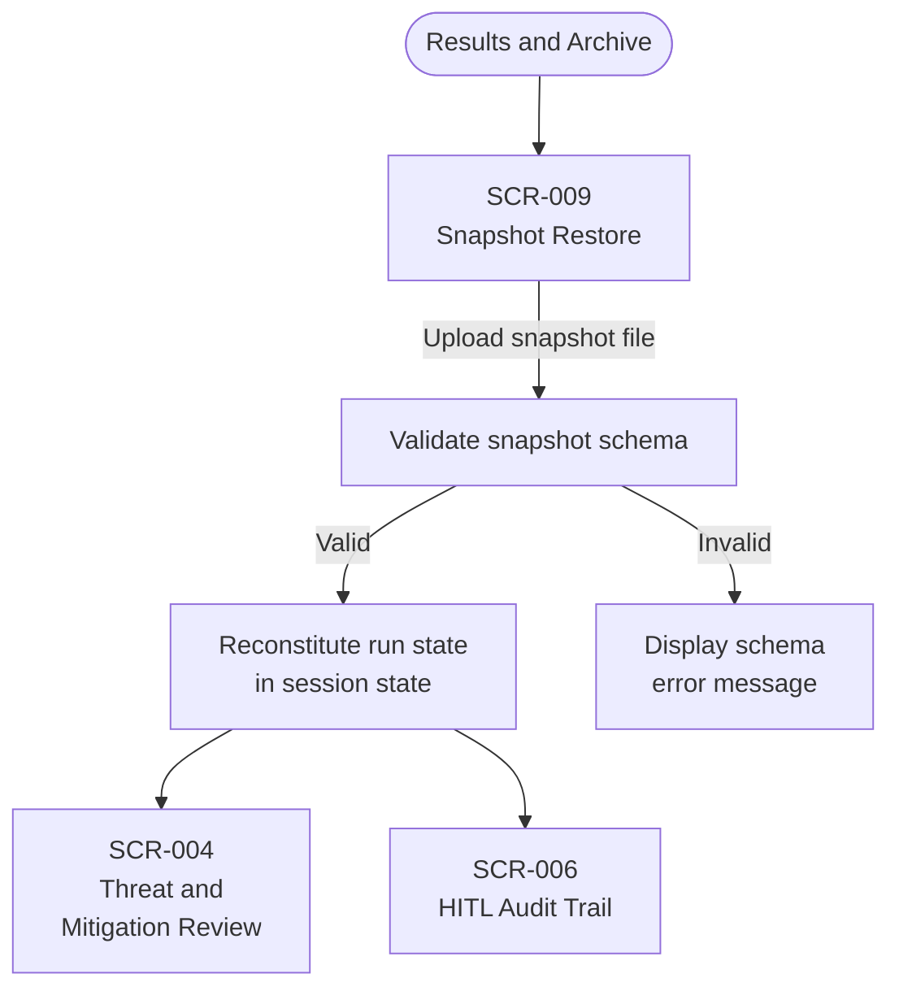

# HMI Architecture Blueprint

**Document ID:** HMI-ARCH-001
**Status:** Draft v0.1
**Date:** 2026-05-03
**Sprint:** 2026-05 (S05-10 / S05-06 deliverable)
**Authority:** This document is the design authority for all analyst-facing GUI screens. S05-04 HITL Gate Set 1 screen implementation SHALL conform to the patterns defined here.

---

## 1. Purpose and Scope

This blueprint consolidates all GUI requirements (GUI-001 through GUI-014) into a unified human-machine interface architecture. It defines:

- Application structure and primary navigation model
- Screen inventory and section groupings
- Navigation flows for primary analyst workflows
- Shared UI component patterns
- Role-based screen visibility and action gating
- State management model (API-sourced vs. local UI state)
- Technology selection rationale

All screens implemented in this system SHALL conform to the patterns defined in this document. Changes to the navigation model, shared components, or role gating SHALL require an update to this document before implementation.

**Requirement Links:** PRJ-006, PRJ-008, PRJ-012, PRJ-016, PRJ-017, PRJ-018, INT-013, INT-015, GUI-001 through GUI-014

---

## 2. Technology Selection

### 2.1 MVP Framework: Streamlit

The MVP implementation SHALL use **Streamlit** as the HMI framework.

| Criterion | Rationale |
|---|---|
| Rapid iteration | Single Python codebase, no frontend build toolchain required |
| Data-native | Native rendering of dataframes, JSON, and Mermaid diagrams via st.components |
| Session state | `st.session_state` provides a sufficient local state store for the MVP |
| Authentication | Streamlit-Authenticator library provides role-based login gate |
| Offline-capable | Runs fully local; no cloud dependency for the HMI layer |

### 2.2 Production Migration Path

The architecture is designed to allow migration to a React (web) or PySide6/Qt (desktop) frontend by isolating all pipeline interaction behind the **Pipeline API Contract** (see Section 6). The Streamlit layer consumes this contract; a React or Qt frontend would consume the same contract.

---

## 3. Application Structure

The HMI is organized as a **single-page application with a left-sidebar navigation rail**. The sidebar is always visible. The main content area renders the active screen.

```
┌─────────────────────────────────────────────────────────────────┐
│  LOGO / APP NAME                              [Role: Analyst ▼] │
├──────────────┬──────────────────────────────────────────────────┤
│              │                                                   │
│  ◉ Analysis  │                                                   │
│              │         MAIN CONTENT AREA                         │
│  ○ HITL      │         (active screen renders here)              │
│    Review    │                                                   │
│              │                                                   │
│  ○ Results & │                                                   │
│    Archive   │                                                   │
│              │                                                   │
│  ○ Config    │                                                   │
│              │                                                   │
└──────────────┴──────────────────────────────────────────────────┘
```

### 3.1 Navigation Sections

| Section | Nav Label | Screens Included | GUI Requirements |
|---|---|---|---|
| Analysis Workflow | Analysis | Input Entry, Pipeline Status, Stage Results, Threat Review | GUI-001, GUI-003, GUI-004, GUI-005 |
| HITL Review | HITL Review | Gate Screen (per gate), Audit Trail | GUI-002 |
| Results and Archive | Results & Archive | Export, Snapshot Export, Snapshot Restore | GUI-006, GUI-007, GUI-008 |
| Configuration | Config | Agent Prompt Editor, Prompt History, Model Provider, Model Connection, Connection Validation | GUI-009, GUI-010, GUI-012, GUI-013, GUI-014 |

### 3.2 Configuration Ordering Dependency

**Critical constraint:** Configuration screens (GUI-012 through GUI-014) MUST be accessible and a valid model connection MUST be confirmed before the analyst can initiate a pipeline run. The Run button on the Input Entry screen (GUI-001) SHALL remain disabled until `model_connection_valid == True` is present in session state. A banner on GUI-001 SHALL direct the analyst to Config when this condition is not met.

---

## 4. Screen Inventory

| Screen ID | Screen Name | Nav Section | GUI Req | Sub-path | Min Role |
|---|---|---|---|---|---|
| SCR-001 | Input Entry Form | Analysis | GUI-001 | /analysis/input | Analyst |
| SCR-002 | Pipeline Status Dashboard | Analysis | GUI-003 | /analysis/status | Analyst |
| SCR-003 | Stage Results Viewer | Analysis | GUI-004 | /analysis/results/{stage_id} | Analyst |
| SCR-004 | Threat and Mitigation Review | Analysis | GUI-005 | /analysis/threats | Analyst |
| SCR-005 | HITL Gate Screen | HITL Review | GUI-002 | /hitl/gate/{gate_id} | Analyst |
| SCR-006 | HITL Audit Trail | HITL Review | GUI-002 | /hitl/audit | Analyst |
| SCR-007 | Results Export | Results & Archive | GUI-006 | /archive/export | Analyst |
| SCR-008 | Snapshot Export | Results & Archive | GUI-007 | /archive/snapshot/export | Analyst |
| SCR-009 | Snapshot Restore | Results & Archive | GUI-008 | /archive/snapshot/restore | Analyst |
| SCR-010 | Agent Prompt Editor | Config | GUI-009 | /config/prompts/{agent_id} | PromptEditor |
| SCR-011 | Prompt Version History | Config | GUI-010 | /config/prompts/{agent_id}/history | PromptEditor |
| SCR-012 | Model Provider Selection | Config | GUI-012 | /config/model/provider | Admin |
| SCR-013 | Model Connection Details | Config | GUI-013 | /config/model/connection | Admin |
| SCR-014 | Model Connection Validation | Config | GUI-014 | /config/model/validate | Admin |

---

## 5. Navigation Flows

### 5.1 Primary Analysis Workflow



### 5.2 Configuration Workflow



### 5.3 Snapshot Restore Workflow



---

## 6. Shared Component Library

All screens are assembled from the following reusable components. Implementations SHALL use these patterns consistently.

### 6.1 Status Indicator

Used on: SCR-002, SCR-005, SCR-014

| State | Visual | Description |
|---|---|---|
| `pending` | Gray circle | Stage not yet reached |
| `running` | Animated spinner (blue) | Stage currently executing |
| `passed` | Green checkmark | Stage completed without critical issues |
| `gate_waiting` | Yellow pause icon | HITL gate is open and awaiting decision |
| `halted` | Red X | Validation halt — execution stopped |
| `complete` | Blue checkmark | Full run finished |

```
Component: StatusIndicator(stage_id, status, label)
Props:
  stage_id  : str   — e.g. "agent_03"
  status    : Literal["pending","running","passed","gate_waiting","halted","complete"]
  label     : str   — display name of the stage
Renders: icon + color badge + label text
```

### 6.2 Action Bar (Approve / Edit / Override)

Used on: SCR-005 (HITL Gate Screen), SCR-004 (Threat Review)

```
Component: ActionBar(actions, on_submit, rationale_required)
Props:
  actions           : list of Literal["approve","edit","override","reject"]
  on_submit         : callable(action: str, rationale: str, edits: dict | None)
  rationale_required: list[str] — action names that require non-empty rationale
Renders:
  [Approve]  [Edit ▼]  [Override]
  Rationale: ___________________________________
  [Submit Decision]
Behavior:
  - Submit is disabled if a rationale_required action is selected and rationale is empty
  - Edit action expands an inline editor pre-populated with the current artifact
```

### 6.3 Artifact Viewer

Used on: SCR-003 (Stage Results), SCR-004 (Threat Review), SCR-005 (HITL Gate)

```
Component: ArtifactViewer(artifact, render_mode)
Props:
  artifact    : dict | str — the stage output payload
  render_mode : Literal["json","markdown","table","mermaid"]
Renders:
  - json     → syntax-highlighted collapsible JSON tree
  - markdown → rendered Markdown
  - table    → sortable dataframe table (st.dataframe)
  - mermaid  → rendered diagram via st.components.v1.html
Includes: [Copy] [Download] action buttons in top-right corner
```

### 6.4 Role-Gated Button

Used on: All screens with restricted actions (see Section 7)

```
Component: RoleGatedButton(label, required_role, current_role, on_click)
Props:
  label         : str
  required_role : str  — minimum role level required
  current_role  : str  — role from st.session_state["user_role"]
  on_click      : callable
Behavior:
  - If current_role >= required_role: renders as active button
  - If current_role < required_role: renders as disabled button with tooltip
    "Requires [required_role] role"
  - Never hidden — always visible but visually disabled for unauthorized users
```

### 6.5 Pipeline Run Banner

Used on: SCR-001 (Input Entry Form)

Persistent banner at top of SCR-001 that reflects model connection state:

```
[!] Model connection not configured. Go to Config → Model Provider to set up before running.
```

When `model_connection_valid == True`: banner is replaced with:

```
[✓] Connected: {provider_name} / {model_name}  [Change]
```

### 6.6 Notification Toast

Used on: All screens for transient feedback (save success, export complete, validation failure).

```
Component: notify(message, level)
Props:
  message : str
  level   : Literal["info","success","warning","error"]
Renders: Streamlit st.toast() with appropriate icon and 4-second auto-dismiss
```

---

## 7. Role-Based Screen Visibility and Action Gating

Roles (ordered lowest to highest privilege): `Viewer` < `Analyst` < `PromptEditor` < `Admin`

| Screen | View | Approve/Reject | Edit/Override | Export/Snapshot | Prompt Edit | Model Config |
|---|---|---|---|---|---|---|
| SCR-001 Input Entry | Analyst | — | — | — | — | — |
| SCR-002 Pipeline Status | Analyst | — | — | — | — | — |
| SCR-003 Stage Results | Analyst | — | — | — | — | — |
| SCR-004 Threat Review | Analyst | Analyst | PromptEditor | Analyst | — | — |
| SCR-005 HITL Gate | Analyst | Analyst | Analyst | — | — | — |
| SCR-006 HITL Audit | Analyst | — | — | — | — | — |
| SCR-007 Export | Analyst | — | — | Analyst | — | — |
| SCR-008 Snapshot Export | Analyst | — | — | Analyst | — | — |
| SCR-009 Snapshot Restore | Analyst | — | — | Analyst | — | — |
| SCR-010 Prompt Editor | PromptEditor | — | PromptEditor | — | PromptEditor | — |
| SCR-011 Prompt History | PromptEditor | — | PromptEditor | — | PromptEditor | — |
| SCR-012 Model Provider | Admin | — | Admin | — | — | Admin |
| SCR-013 Model Connection | Admin | — | Admin | — | — | Admin |
| SCR-014 Conn Validation | Admin | — | — | — | — | Admin |

**Rules:**
- Nav section items are hidden entirely if the authenticated user has no role granting view access to any screen in the section.
- Individual actions within a screen are rendered as disabled (not hidden) for insufficient role, per RoleGatedButton pattern.
- Session role is set at login and stored in `st.session_state["user_role"]`. It is not modifiable by the user during the session.

---

## 8. State Management Model

### 8.1 API-Sourced State (Pipeline State)

The following data is owned by the pipeline backend and fetched by the HMI layer. The HMI SHALL NOT maintain its own copy except as a display cache.

| State Item | Source | HMI Cache Key |
|---|---|---|
| Current run ID | Pipeline API | `session_state["run_id"]` |
| Stage execution status per stage | Pipeline API (polled or streamed) | `session_state["stage_statuses"]` |
| Stage output artifacts | Pipeline API (on demand) | `session_state["stage_artifacts"][stage_id]` |
| HITL gate open/closed state | Pipeline API | `session_state["hitl_gates"]` |
| Canonical threat model graph | Pipeline API | `session_state["canonical_graph"]` |

### 8.2 Local UI State (Session State)

The following data is owned by the HMI session and is not sent to the pipeline until explicitly submitted.

| State Item | Lifecycle | Key |
|---|---|---|
| Authenticated user role | Set at login, cleared on logout | `session_state["user_role"]` |
| Model connection valid flag | Set by SCR-014 on test-pass | `session_state["model_connection_valid"]` |
| Selected model provider | Set by SCR-012 | `session_state["model_provider"]` |
| Active model config (non-secret fields) | Set by SCR-013 | `session_state["model_config"]` |
| In-progress HITL decision (pre-submit) | Set by ActionBar interaction | `session_state["hitl_draft"]` |
| In-progress prompt edit (pre-save) | Set by SCR-010 editor | `session_state["prompt_draft"][agent_id]` |
| Active screen / sub-path | Set by sidebar nav | `session_state["active_screen"]` |

### 8.3 Credential Handling

API keys and credentials entered in SCR-013 SHALL be written to the system keyring (via `keyring` library) or encrypted local store (Fernet fallback) as defined in the Model Configuration Design Specification. They SHALL NOT be stored in `st.session_state`. The HMI layer retrieves credentials at run-initiation time from the credential store and passes them to the pipeline via the connection contract (INT-015).

---

## 9. Screen Specifications (Wireframe Level)

### 9.1 SCR-001: Input Entry Form (GUI-001)

```
┌─ Analysis / Input Entry ──────────────────────────────────────┐
│ [!] Model connection not configured. Go to Config → Model.    │  ← Pipeline Run Banner (§6.5)
├───────────────────────────────────────────────────────────────┤
│ System Name:        [_________________________________]        │
│ Description:        [_________________________________]        │
│                     [_________________________________]        │
│ Mission Criticality:[High ▼]  Safety Criticality:[High ▼]     │
│                                                               │
│ ── Subsystems / Components ──────────────────────────────────  │
│  [Upload ICD (CSV or XLSX)]  or  [Enter manually +]           │
│                                                               │
│ ── Interfaces ───────────────────────────────────────────────  │
│  [Upload Interface Table (CSV or XLSX)]  or  [Enter manually +]│
│                                                               │
│ ── Narrative Documents ──────────────────────────────────────  │
│  [Upload System Description (MD or TXT)]                      │
│                                                               │
│                              [Clear]  [▶ Run Analysis]        │
│                                       (disabled until conn valid)
└───────────────────────────────────────────────────────────────┘
```

### 9.2 SCR-002: Pipeline Status Dashboard (GUI-003)

```
┌─ Analysis / Pipeline Status ──────────────────────────────────┐
│  Run ID: run-20260503-001          Status: ● Running          │
├───────────────────────────────────────────────────────────────┤
│  ✓ Agent 01  Input Normalizer      [passed]   View Results →  │
│  ✓ Agent 02  Context Builder       [passed]   View Results →  │
│  ● Agent 03  Trust Boundary Val.   [running]                  │
│  ○ Agent 04  STRIDE Scorer         [pending]                  │
│  ○ Agent 05  Threat Generator      [pending]                  │
│  ○ Agent 06  STIX Packager         [pending]                  │
│  ○ Agent 07  Mitigation Generator  [pending]                  │
│  ○ Agent 08  Diagram Generator     [pending]                  │
│  ○ Agent 09  Report Writer         [pending]                  │
├───────────────────────────────────────────────────────────────┤
│  [■ Abort Run]                                                │
└───────────────────────────────────────────────────────────────┘
```

### 9.3 SCR-005: HITL Gate Screen (GUI-002)

```
┌─ HITL Review / Gate: Trust Boundary Validation ───────────────┐
│  Gate ID: GATE-03   Stage: Agent 03   Status: ⏸ Awaiting      │
├───────────────────────────────────────────────────────────────┤
│  Stage Output Artifact:                                       │
│  ┌─ ArtifactViewer (mode=json) ────────────────────────────┐  │
│  │  { "trust_boundaries": [...], "issues": [...] }         │  │
│  │                                          [Copy][Download]│  │
│  └─────────────────────────────────────────────────────────┘  │
├───────────────────────────────────────────────────────────────┤
│  Decision:                                                    │
│  ┌─ ActionBar (approve, edit, override) ───────────────────┐  │
│  │  [✓ Approve]  [✎ Edit ▼]  [⚠ Override]                  │  │
│  │  Rationale: [___________________________________]        │  │
│  │  (required for Override)                                 │  │
│  │                              [Submit Decision]           │  │
│  └─────────────────────────────────────────────────────────┘  │
└───────────────────────────────────────────────────────────────┘
```

### 9.4 SCR-012/013/014: Model Configuration Screens (GUI-012–014)

See [Model_Configuration_Design_Specification.md](Model_Configuration_Design_Specification.md) for full wireframes and component detail. This blueprint establishes that SCR-012, SCR-013, and SCR-014 reside in the Config navigation section, require Admin role, and feed the `model_connection_valid` flag consumed by SCR-001.

---

## 10. Implementation Notes for S05-04 (HITL Gate Set 1)

When implementing S05-04, the following constraints from this blueprint apply:

1. Each HITL gate screen SHALL be an instance of SCR-005 parameterized by `gate_id`.
2. The ActionBar component (§6.2) SHALL be used for all approve/edit/override actions.
3. The ArtifactViewer component (§6.3) SHALL render the gate's stage output artifact.
4. Role gating SHALL use RoleGatedButton (§6.4) — Analyst minimum for approve/edit; no lower.
5. HITL audit trail (SCR-006) SHALL be populated from the pipeline's decision log, not from local session state.
6. Status after gate decision SHALL update the StatusIndicator (§6.1) on SCR-002 in real time.

---

## 11. Cross-Reference to Requirements

| Blueprint Section | Requirements |
|---|---|
| §3 Application Structure | PRJ-016, GUI-001 through GUI-014 |
| §3.2 Config Ordering Dependency | GUI-014, PRJ-008 |
| §4 Screen Inventory | GUI-001 through GUI-014 |
| §5 Navigation Flows | PRJ-016, PRJ-006 |
| §6.1 Status Indicator | GUI-003 |
| §6.2 Action Bar | GUI-002, GUI-005 |
| §6.3 Artifact Viewer | GUI-004, GUI-005 |
| §6.4 Role-Gated Button | GUI-011, INT-013, PRJ-012 |
| §6.5 Pipeline Run Banner | GUI-014 |
| §7 Role-Based Access | GUI-011, INT-013, PRJ-012 |
| §8.3 Credential Handling | GUI-013, INT-015, PRJ-008 |
| §9.4 Model Config Screens | GUI-012, GUI-013, GUI-014, INT-015 |
| §10 S05-04 Implementation Notes | GUI-002, PRJ-006, HITL-001–011 |
