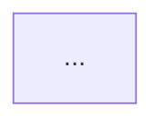
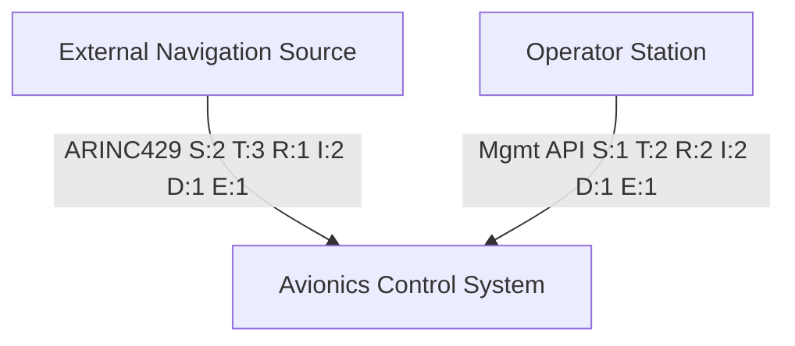
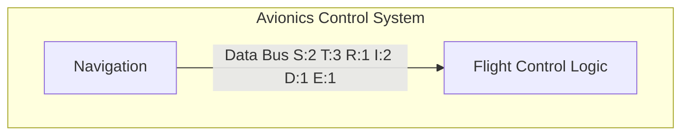
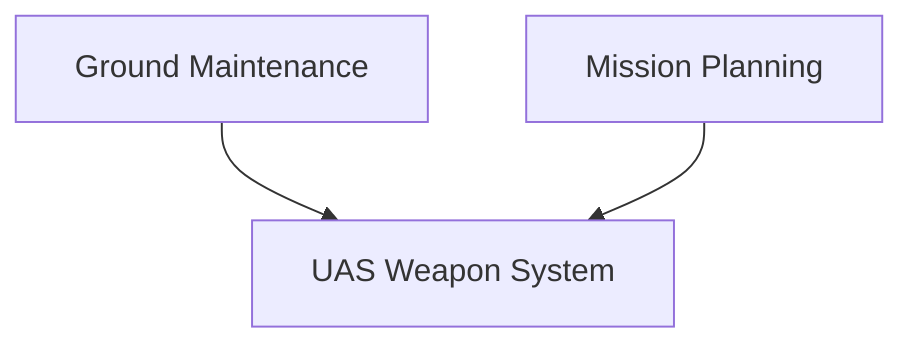
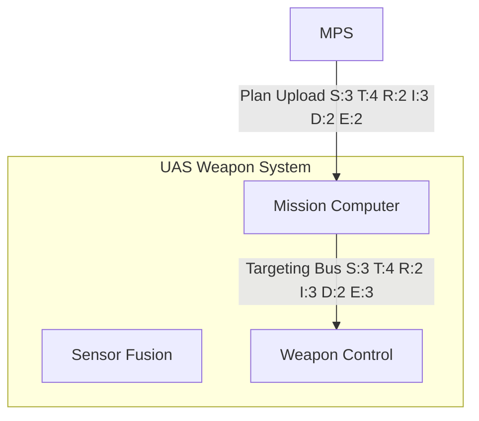
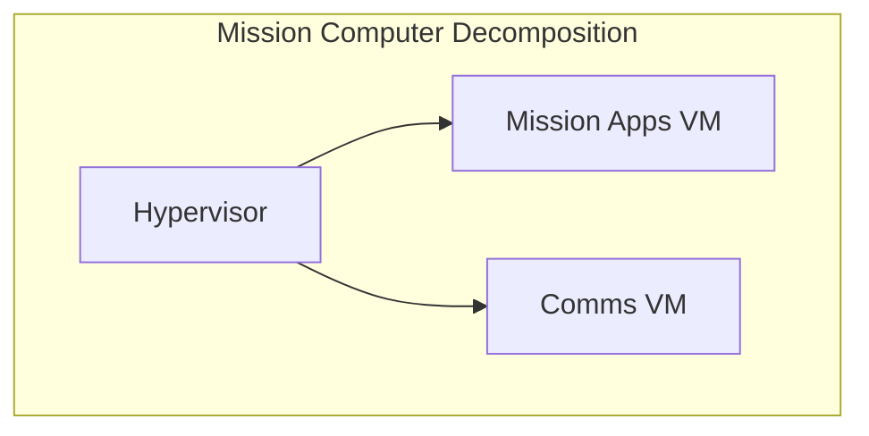

# Agent 08 Diagram Generator Examples

Purpose: hold reference output patterns for Mermaid sectioning and multi-level decomposition.

## Required Section Marker Pattern

```text
MERMAID_LEVEL0


MERMAID_LEVEL1

```

## Example A (Two Levels)

```text
MERMAID_LEVEL0


MERMAID_LEVEL1

```

## Example B (Three Levels)

```text
MERMAID_LEVEL0


MERMAID_LEVEL1


MERMAID_LEVEL2

```

## Notes

- Always emit MERMAID_LEVEL0.
- Emit additional levels only when complexity justifies deeper detail.
- Keep levels sequential with no gaps.
- Do not invent stack details absent in canonical evidence.
