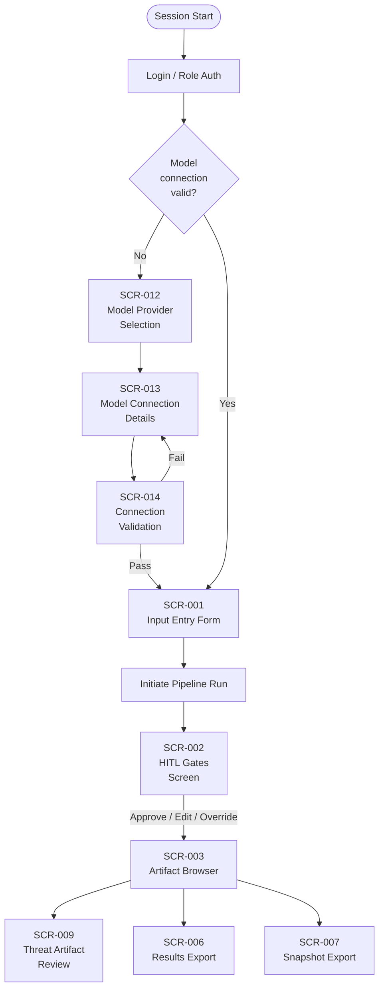
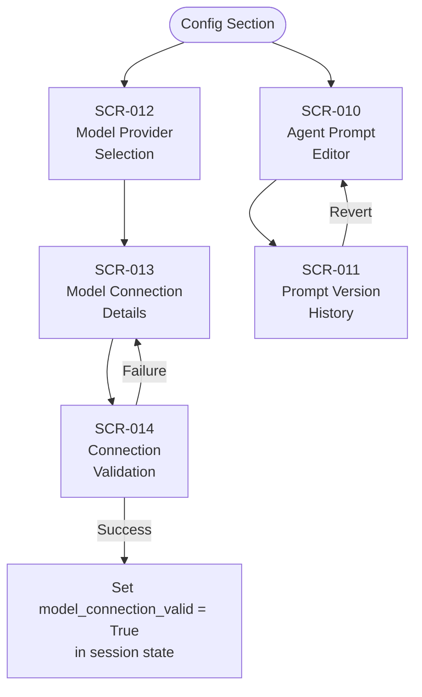
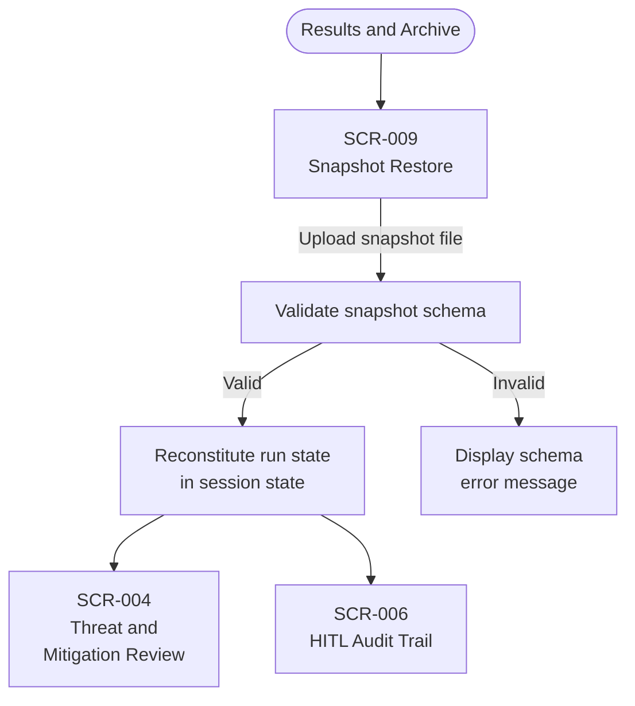

# HMI Architecture Blueprint

**Document ID:** HMI-ARCH-001
**Status:** Draft v0.2
**Date:** 2026-05-03
**Sprint:** 2026-05 (S05-10 / S05-06 deliverable)
**Authority:** This document is the architecture authority for all analyst-facing GUI screens. Detailed subsystem behavior may be elaborated in software design specifications under `docs/design/software/`, but GUI structure, navigation, role gating, and shared interaction patterns SHALL conform to this blueprint.

---

## 1. Purpose and Scope

This blueprint consolidates all GUI requirements (GUI-001 through GUI-014) into a unified human-machine interface architecture. It defines:

- Application structure and primary navigation model
- Screen inventory and section groupings
- Navigation flows for primary analyst workflows
- Shared UI component patterns
- Role-based screen visibility and action gating
- State management model (API-sourced vs. local UI state)
- Technology selection rationale

All screens implemented in this system SHALL conform to the patterns defined in this document. Changes to the navigation model, shared components, or role gating SHALL require an update to this document before implementation.

**Requirement Links:** PRJ-006 HITL Governance, PRJ-008 Configurable Model Selection, PRJ-012 Role-Based Access Control, PRJ-016 Analyst Graphical Interface, PRJ-017 Run Snapshot Portability, PRJ-018 Agent Prompt Configurability, INT-013 Authorization Contract, INT-015 Model Connection Contract, and the analyst-facing GUI requirement set from GUI-001 Input Entry Form through GUI-014 Model Connection Validation.

The identifiers remain important for traceability, but this blueprint is written so a reviewer can understand the navigation and screen structure without cross-referencing the requirement catalog on every page.

---

## 2. Technology Selection

### 2.1 MVP Framework: Streamlit

The MVP implementation SHALL use **Streamlit** as the HMI framework.

| Criterion | Rationale |
|---|---|
| Rapid iteration | Single Python codebase, no frontend build toolchain required |
| Data-native | Native rendering of dataframes, JSON, and Mermaid diagrams via st.components |
| Session state | `st.session_state` provides a sufficient local state store for the MVP |
| Authentication | Streamlit-Authenticator library provides role-based login gate |
| Offline-capable | Runs fully local; no cloud dependency for the HMI layer |

### 2.2 Production Migration Path

The architecture is designed to allow migration to a React (web) or PySide6/Qt (desktop) frontend by isolating all pipeline interaction behind the **Pipeline API Contract** (see Section 6). The Streamlit layer consumes this contract; a React or Qt frontend would consume the same contract.

---

## 3. Application Structure

The HMI is organized as a **single-page application with a left-sidebar navigation rail**. The sidebar is always visible. The main content area renders the active screen.

The upper header section (directly below the Threat Modeler Control Console title and connection indicator) provides two always-visible control rows. The header is the authoritative navigation surface for artifact-domain and review/export workflows, while the persistent left rail remains the global app and run/workspace control surface.

- Header Row 1 provides operator workflow switching: HITL GATES, TOKENS, Threat Review, Results Export, Last Prompt, Prompt Editor.
- Header Row 2 provides artifact-screen switching with icon-labeled tabs: Canonical Graph, Trust Boundaries, STRIDE Viewer, Threats, Mermaid Diagrams, STIX Bundle, Report.

The left rail does not duplicate artifact-domain switching and is reserved for setup, active run controls, operator shortcuts, and run inventory management.

When a run is created from the setup wizard, the shell pins that exact run ID as the active run and marks its row in All Runs with a temporary `Created by wizard` badge for 30 seconds to make auto-selection intent explicit.

```
┌─────────────────────────────────────────────────────────────────┐
│  LOGO / APP NAME                              [Role: Analyst ▼] │
├──────────────┬──────────────────────────────────────────────────┤
│              │                                                   │
│  ◉ Analysis  │                                                   │
│              │         MAIN CONTENT AREA                         │
│  ○ HITL      │         (active screen renders here)              │
│    Review    │                                                   │
│              │                                                   │
│  ○ Results & │                                                   │
│    Archive   │                                                   │
│              │                                                   │
│  ○ Config    │                                                   │
│              │                                                   │
└──────────────┴──────────────────────────────────────────────────┘
```

### 3.1 Navigation Sections

| Section | Nav Label | Screens Included | GUI Requirements |
|---|---|---|---|
| HITL Gates | HITL GATES | Gate Screen (per gate), Audit Trail, footer status timeline | GUI-002 HITL Gate Screens; GUI-030 Ordered HITL Gates Ledger; GUI-031 Persistent Timeline Status and Gate-Centric Monitoring |
| Artifact and Review Header | Header Rows 1 and 2 | Canonical Graph, Trust Boundaries, STRIDE Viewer, Threats, Mermaid, STIX, Report, Threat Review, Results Export, Tokens, Last Prompt, Prompt Editor | GUI-005 Threat Artifact Review Screen; GUI-006 Results Export Interface; GUI-015 Token Usage Telemetry Dashboard and Export; GUI-018 STIX Threat Model Viewer; GUI-019 Canonical Graph Viewer; GUI-020 Mermaid Diagram Viewer; GUI-021 STRIDE Threat Model Viewer; GUI-022 STRIDE Threat Model Export; GUI-023 Results Export Quick Preview Functionality; GUI-024 Component and File Version Visibility; GUI-025 Markdown Viewer and Editor; GUI-041 Header-Authoritative Artifact Domain Navigation; GUI-042 Header Review and Export Icon Entry Points |
| Configuration | Config | Agent Prompt Editor, Prompt History, Model Provider, Model Connection, Connection Validation | GUI-009 Agent Prompt Editor; GUI-010 Agent Prompt Version History; GUI-012 Model Provider Selection Screen; GUI-013 Model Connection Details Configuration; GUI-014 Model Connection Validation |

### 3.2 Configuration Ordering Dependency

**Critical constraint:** Configuration screens GUI-012 Model Provider Selection Screen through GUI-014 Model Connection Validation MUST be accessible and a valid model connection MUST be confirmed before the analyst can initiate a pipeline run. The Run button on GUI-001 Input Entry Form SHALL remain disabled until `model_connection_valid == True` is present in session state. A banner on GUI-001 SHALL direct the analyst to Config when this condition is not met.

---

## 4. Screen Inventory

| Screen ID | Screen Name | Nav Section | GUI Req | Sub-path | Min Role |
|---|---|---|---|---|---|
| SCR-001 | Input Entry Form | Config | GUI-001 | /analysis/input | Analyst |
| SCR-002 | HITL Gates Screen | HITL Gates | GUI-002, GUI-030, GUI-031 | /hitl/gates | Analyst |
| SCR-003 | Artifact Browser | Artifacts | GUI-005, GUI-006, GUI-007, GUI-008, GUI-015, GUI-018, GUI-019, GUI-020, GUI-021, GUI-022, GUI-023, GUI-024, GUI-025 | /artifacts | Analyst |
| SCR-004 | Stage Results Viewer | Artifacts | GUI-004 | /analysis/results/{stage_id} | Analyst |
| SCR-005 | HITL Audit Trail | HITL Gates | GUI-002 | /hitl/audit | Analyst |
| SCR-006 | Results Export | Artifacts | GUI-006 | /archive/export | Analyst |
| SCR-007 | Snapshot Export | Artifacts | GUI-007 | /archive/snapshot/export | Analyst |
| SCR-008 | Snapshot Restore | Artifacts | GUI-008 | /archive/snapshot/restore | Analyst |
| SCR-009 | Threat Artifact Review | Artifacts | GUI-005 | /artifacts/threats | Analyst |
| SCR-010 | Agent Prompt Editor | Config | GUI-009 | /config/prompts/{agent_id} | PromptEditor |
| SCR-011 | Prompt Version History | Config | GUI-010 | /config/prompts/{agent_id}/history | PromptEditor |
| SCR-012 | Model Provider Selection | Config | GUI-012 | /config/model/provider | Admin |
| SCR-013 | Model Connection Details | Config | GUI-013 | /config/model/connection | Admin |
| SCR-014 | Model Connection Validation | Config | GUI-014 | /config/model/validate | Admin |

---

## 5. Navigation Flows

### 5.0 HITL Gate Enforcement Update (Sprint 2026-12)

The HITL flow is updated with two enforced controls:

- **Gate 0 Input Integrity Preflight**: must be reviewed before Stage 1 executes.
- **Gate 1 Normalization Review**: must be reviewed after Stage 1 and before Stage 2 executes.

These controls SHALL be represented on the footer execution timeline with gate markers before Stage 1 and after each gated stage boundary so operators can track review points in execution order.

### 5.1 Primary HITL and Artifact Workflow



### 5.2 Configuration Workflow



### 5.3 Snapshot Restore Workflow



---

## 6. Shared Component Library

All screens are assembled from the following reusable components. Implementations SHALL use these patterns consistently.

### 6.1 Status Indicator

Used on: SCR-002, SCR-005, SCR-014

| State | Visual | Description |
|---|---|---|
| `pending` | Gray circle | Stage not yet reached |
| `running` | Animated spinner (blue) | Stage currently executing |
| `passed` | Green checkmark | Stage completed without critical issues |
| `gate_waiting` | Yellow pause icon | HITL gate is open and awaiting decision |
| `halted` | Red X | Validation halt — execution stopped |
| `complete` | Blue checkmark | Full run finished |

```
Component: StatusIndicator(stage_id, status, label)
Props:
  stage_id  : str   — e.g. "agent_03"
  status    : Literal["pending","running","passed","gate_waiting","halted","complete"]
  label     : str   — display name of the stage
Renders: icon + color badge + label text
```

### 6.2 Action Bar (Approve / Edit / Override)

Used on: SCR-005 (HITL Gate Screen), SCR-004 (Threat Review)

```
Component: ActionBar(actions, on_submit, rationale_required)
Props:
  actions           : list of Literal["approve","edit","override","reject"]
  on_submit         : callable(action: str, rationale: str, edits: dict | None)
  rationale_required: list[str] — action names that require non-empty rationale
Renders:
  [Approve]  [Edit ▼]  [Override]
  Rationale: ___________________________________
  [Submit Decision]
Behavior:
  - Submit is disabled if a rationale_required action is selected and rationale is empty
  - Edit action expands an inline editor pre-populated with the current artifact
```

### 6.3 Artifact Viewer

Used on: SCR-003 (Stage Results), SCR-004 (Threat Review), SCR-005 (HITL Gate)

```
Component: ArtifactViewer(artifact, render_mode)
Props:
  artifact    : dict | str — the stage output payload
  render_mode : Literal["json","markdown","table","mermaid"]
Renders:
  - json     → syntax-highlighted collapsible JSON tree
  - markdown → rendered Markdown
  - table    → sortable dataframe table (st.dataframe)
  - mermaid  → rendered diagram via st.components.v1.html
Includes: [Copy] [Download] action buttons in top-right corner
```

### 6.7 Gate-Specific Human Readable Review Panels

Used on: SCR-005 (HITL Gate Screen)

```
Component: GateReadableSummary(gate_id, artifact_snapshot)
Props:
  gate_id          : str
  artifact_snapshot: dict | None
Behavior:
  - For gate_0_input_integrity: render preflight checks (source presence, raw text summary, table summary).
  - For gate_1_normalization_review: render normalized graph summary (system info, subsystem/component/function/interface counts, interface preview, validation checks).
  - Fallback to generic key-value summary when specialized renderer not defined.
```

### 6.4 Role-Gated Button

Used on: All screens with restricted actions (see Section 7)

```
Component: RoleGatedButton(label, required_role, current_role, on_click)
Props:
  label         : str
  required_role : str  — minimum role level required
  current_role  : str  — role from st.session_state["user_role"]
  on_click      : callable
Behavior:
  - If current_role >= required_role: renders as active button
  - If current_role < required_role: renders as disabled button with tooltip
    "Requires [required_role] role"
  - Never hidden — always visible but visually disabled for unauthorized users
```

### 6.5 Pipeline Run Banner

Used on: SCR-001 (Input Entry Form)

Persistent banner at top of SCR-001 that reflects model connection state:

```
[!] Model connection not configured. Go to Config → Model Provider to set up before running.
```

When `model_connection_valid == True`: banner is replaced with:

```
[✓] Connected: {provider_name} / {model_name}  [Change]
```

### 6.6 Notification Toast

Used on: All screens for transient feedback (save success, export complete, validation failure).

```
Component: notify(message, level)
Props:
  message : str
  level   : Literal["info","success","warning","error"]
Renders: Streamlit st.toast() with appropriate icon and 4-second auto-dismiss
```

---

## 7. Role-Based Screen Visibility and Action Gating

Roles (ordered lowest to highest privilege): `Viewer` < `Analyst` < `PromptEditor` < `Admin`

| Screen | View | Approve/Reject | Edit/Override | Export/Snapshot | Prompt Edit | Model Config |
|---|---|---|---|---|---|---|
| SCR-001 Input Entry | Analyst | — | — | — | — | — |
| SCR-002 Pipeline Status | Analyst | — | — | — | — | — |
| SCR-003 Stage Results | Analyst | — | — | — | — | — |
| SCR-004 Threat Review | Analyst | Analyst | PromptEditor | Analyst | — | — |
| SCR-005 HITL Gate | Analyst | Analyst | Analyst | — | — | — |
| SCR-006 HITL Audit | Analyst | — | — | — | — | — |
| SCR-007 Export | Analyst | — | — | Analyst | — | — |
| SCR-008 Snapshot Export | Analyst | — | — | Analyst | — | — |
| SCR-009 Snapshot Restore | Analyst | — | — | Analyst | — | — |
| SCR-010 Prompt Editor | PromptEditor | — | PromptEditor | — | PromptEditor | — |
| SCR-011 Prompt History | PromptEditor | — | PromptEditor | — | PromptEditor | — |
| SCR-012 Model Provider | Admin | — | Admin | — | — | Admin |
| SCR-013 Model Connection | Admin | — | Admin | — | — | Admin |
| SCR-014 Conn Validation | Admin | — | — | — | — | Admin |

**Rules:**

- Nav section items are hidden entirely if the authenticated user has no role granting view access to any screen in the section.
- Individual actions within a screen are rendered as disabled (not hidden) for insufficient role, per RoleGatedButton pattern.
- Session role is set at login and stored in `st.session_state["user_role"]`. It is not modifiable by the user during the session.

---

## 8. State Management Model

### 8.1 API-Sourced State (Pipeline State)

The following data is owned by the pipeline **backend** and consumed by the HMI layer as
read projections.  The HMI SHALL NOT maintain its own copy except as a display cache.

**Authority module: `src/threat_modeler/backend/run_manager.py`**

The `run_manager` module owns:

- The process-level `_RUN_REGISTRY` (in-memory, thread-safe).
- Background thread lifecycle for `submit_run()` and `resume_run()`.
- JSON persistence of run metadata to `~/.multi_agent_threat_modeler_runs.json`.

The Streamlit UI layer reads backend state via `sync_execution_state_to_session()` in
`ui/execution.py`, which calls `backend.run_manager.get_run_status(run_id)` and mirrors
keys into `st.session_state`.  Screens MUST NOT access `_RUN_REGISTRY` directly.

| State Item | Source | HMI Cache Key |
|---|---|---|
| Current run ID | `run_manager.get_run_status()` | `session_state["run_id"]` |
| Stage execution status per stage | `run_manager.get_run_status()` | `session_state["stage_statuses"]` |
| Stage output artifacts | `run_manager.get_run_status()` | `session_state["stage_artifacts"][stage_id]` |
| HITL gate open/closed state | `run_manager.get_run_status()` | `session_state["hitl_gates"]` |
| Canonical threat model graph | `run_manager.get_run_status()` → `result_state` | `session_state["canonical_graph"]` |

### 8.1.1 Restart Persistence Constraint for Artifact Addressability

To prevent run-list entries that are visible but artifact-inaccessible after process restart,
the backend runtime SHALL persist a restorable run-state projection for completed and paused
runs. On restart, the API layer SHALL be able to rehydrate enough state to serve:

- `GET /runs/{run_id}/artifacts/canonical`
- `GET /runs/{run_id}/artifacts/mermaid`
- `GET /runs/{run_id}/artifacts/stix`
- `GET /runs/{run_id}/artifacts/report`

This constraint ensures that historical runs exposed by `GET /runs` are not presented as
operationally complete while returning `Unknown or incomplete run_id` for artifact retrieval.

### 8.1.2 React Input Ingestion Parity Constraint (CSV/XLSX)

To preserve Agent 01 parse quality and downstream data completeness for Context Builder,
Trust Boundary, STRIDE, and Threat stages, the React Input Entry workflow SHALL enforce:

- CSV and XLSX uploads are parsed into structured rows and submitted via
  `initial_state.tables`.
- Narrative text files (`md`, `txt`, `yaml`, `yml`) are submitted via
  `initial_state.raw_text`.
- Raw spreadsheet binary payloads SHALL NOT be injected into `initial_state.raw_text`.

This keeps React behavior aligned with the established Streamlit ingestion model and
prevents spreadsheet byte-stream contamination that degrades LLM parse reliability.

### 8.2 Local UI State (Session State)

The following data is owned by the HMI session and is not sent to the pipeline until
explicitly submitted.

| State Item | Lifecycle | Key |
|---|---|---|
| Authenticated user role | Set at login, cleared on logout | `session_state["user_role"]` |
| Model connection valid flag | Set by SCR-014 on test-pass | `session_state["model_connection_valid"]` |
| Selected model provider | Set by SCR-012 | `session_state["model_provider"]` |
| Active model config (non-secret fields) | Set by SCR-013 | `session_state["model_config"]` |
| In-progress HITL decision (pre-submit) | Set by ActionBar interaction | `session_state["hitl_draft"]` |
| In-progress prompt edit (pre-save) | Set by SCR-010 editor | `session_state["prompt_draft"][agent_id]` |
| Active screen / sub-path | Set by sidebar nav | `session_state["active_screen"]` |

### 8.3 Credential Handling

API keys and credentials entered in SCR-013 SHALL be written to the system keyring (via
`keyring` library) or encrypted local store (Fernet fallback) as defined in the Model
Configuration Design Specification.  They SHALL NOT be stored in `st.session_state`.
The HMI layer retrieves credentials at run-initiation time from the credential store and
passes them to the pipeline via the connection contract (INT-015).

### 8.4 Prompt Configuration State

Agent prompt text, version history, and temperature settings are persisted by
`backend/prompt_store.py` to `~/.multi_agent_threat_modeler_prompts.json`.
The GUI screens (SCR-010 Prompt Editor, SCR-011 Prompt History) read and write through
the `PromptStore` public API; they do not manage the JSON file directly.

---

## 9. Screen Specifications (Wireframe Level)

### 9.1 SCR-001: Input Entry Form (GUI-001)

```
┌─ Analysis / Input Entry ──────────────────────────────────────┐
│ [!] Model connection not configured. Go to Config → Model.    │  ← Pipeline Run Banner (§6.5)
├───────────────────────────────────────────────────────────────┤
│ System Name:        [_________________________________]        │
│ Description:        [_________________________________]        │
│                     [_________________________________]        │
│ Mission Criticality:[High ▼]  Safety Criticality:[High ▼]     │
│                                                               │
│ ── Subsystems / Components ──────────────────────────────────  │
│  [Upload ICD (CSV or XLSX)]  or  [Enter manually +]           │
│                                                               │
│ ── Interfaces ───────────────────────────────────────────────  │
│  [Upload Interface Table (CSV or XLSX)]  or  [Enter manually +]│
│                                                               │
│ ── Narrative Documents ──────────────────────────────────────  │
│  [Upload System Description (MD or TXT)]                      │
│                                                               │
│                              [Clear]  [▶ Run Analysis]        │
│                                       (disabled until conn valid)
└───────────────────────────────────────────────────────────────┘
```

### 9.2 SCR-002: Pipeline Status Dashboard (GUI-003)

```
┌─ Analysis / Pipeline Status ──────────────────────────────────┐
│  Run ID: run-20260503-001          Status: ● Running          │
├───────────────────────────────────────────────────────────────┤
│  ✓ Agent 01  Input Normalizer      [passed]   View Results →  │
│  ✓ Agent 02  Context Builder       [passed]   View Results →  │
│  ● Agent 03  Trust Boundary Val.   [running]                  │
│  ○ Agent 04  STRIDE Scorer         [pending]                  │
│  ○ Agent 05  Threat Generator      [pending]                  │
│  ○ Agent 06  STIX Packager         [pending]                  │
│  ○ Agent 07  Mitigation Generator  [pending]                  │
│  ○ Agent 08  Diagram Generator     [pending]                  │
│  ○ Agent 09  Report Writer         [pending]                  │
├───────────────────────────────────────────────────────────────┤
│  [■ Abort Run]                                                │
└───────────────────────────────────────────────────────────────┘
```

### 9.3 SCR-005: HITL Gate Screen (GUI-002)

```
┌─ HITL Review / Gate: Trust Boundary Validation ───────────────┐
│  Gate ID: GATE-03   Stage: Agent 03   Status: ⏸ Awaiting      │
├───────────────────────────────────────────────────────────────┤
│  Stage Output Artifact:                                       │
│  ┌─ ArtifactViewer (mode=json) ────────────────────────────┐  │
│  │  { "trust_boundaries": [...], "issues": [...] }         │  │
│  │                                          [Copy][Download]│  │
│  └─────────────────────────────────────────────────────────┘  │
├───────────────────────────────────────────────────────────────┤
│  Decision:                                                    │
│  ┌─ ActionBar (approve, edit, override) ───────────────────┐  │
│  │  [✓ Approve]  [✎ Edit ▼]  [⚠ Override]                  │  │
│  │  Rationale: [___________________________________]        │  │
│  │  (required for Override)                                 │  │
│  │                              [Submit Decision]           │  │
│  └─────────────────────────────────────────────────────────┘  │
└───────────────────────────────────────────────────────────────┘
```

### 9.4 SCR-012/013/014: Model Configuration Screens (GUI-012–014)

See [../design/software/Model_Configuration_Design_Specification.md](../design/software/Model_Configuration_Design_Specification.md) for software-design detail and component behavior. This blueprint establishes that SCR-012, SCR-013, and SCR-014 reside in the Config navigation section, require Admin role, and feed the `model_connection_valid` flag consumed by SCR-001.

---

## 10. Implementation Notes for S05-04 (HITL Gate Set 1)

When implementing S05-04, the following constraints from this blueprint apply:

1. Each HITL gate screen SHALL be an instance of SCR-005 parameterized by `gate_id`.
1. The ActionBar component (§6.2) SHALL be used for all approve/edit/override actions.
1. The ArtifactViewer component (§6.3) SHALL render the gate's stage output artifact.
1. Role gating SHALL use RoleGatedButton (§6.4) — Analyst minimum for approve/edit; no lower.
1. HITL audit trail (SCR-006) SHALL be populated from the pipeline's decision log, not from local session state.
1. Status after gate decision SHALL update the StatusIndicator (§6.1) on SCR-002 in real time.

---

## 11. Cross-Reference to Requirements

| Blueprint Section | Requirements |
|---|---|
| §3 Application Structure | PRJ-016 Analyst Graphical Interface; GUI-001 Input Entry Form through GUI-014 Model Connection Validation |
| §3.2 Config Ordering Dependency | GUI-014 Model Connection Validation; PRJ-008 Configurable Model Selection |
| §4 Screen Inventory | GUI-001 Input Entry Form through GUI-014 Model Connection Validation |
| §5 Navigation Flows | PRJ-016 Analyst Graphical Interface; PRJ-006 HITL Governance |
| §6.1 Status Indicator | GUI-003 Pipeline Status Dashboard |
| §6.2 Action Bar | GUI-002 HITL Gate Screens; GUI-005 Threat Artifact Review Screen |
| §6.3 Artifact Viewer | GUI-004 Stage Results Viewer; GUI-005 Threat Artifact Review Screen |
| §6.4 Role-Gated Button | GUI-011 Role-Enforced GUI Access Control; INT-013 Authorization Contract; PRJ-012 Role-Based Access Control |
| §6.5 Pipeline Run Banner | GUI-014 Model Connection Validation |
| §7 Role-Based Access | GUI-011 Role-Enforced GUI Access Control; INT-013 Authorization Contract; PRJ-012 Role-Based Access Control |
| §8.3 Credential Handling | GUI-013 Model Connection Details Configuration; INT-015 Model Connection Contract; PRJ-008 Configurable Model Selection |
| §9.4 Model Config Screens | GUI-012 Model Provider Selection Screen; GUI-013 Model Connection Details Configuration; GUI-014 Model Connection Validation; INT-015 Model Connection Contract |
| §10 S05-04 Implementation Notes | GUI-002 HITL Gate Screens; PRJ-006 HITL Governance; HITL-001 through HITL-011 implementation notes |
